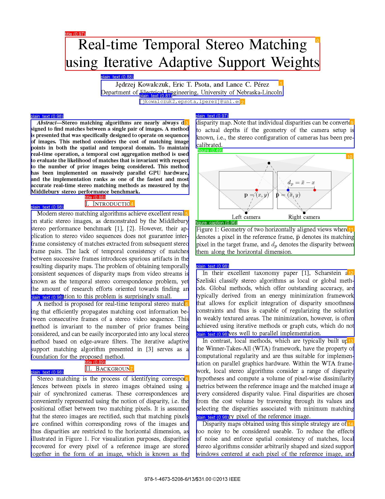
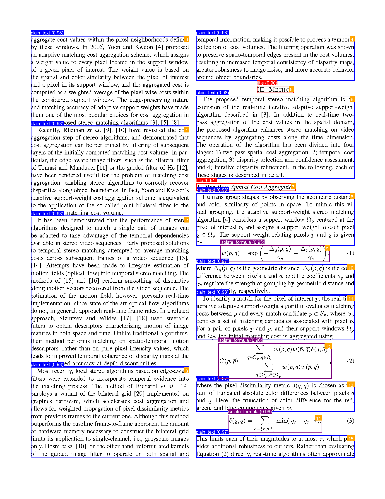
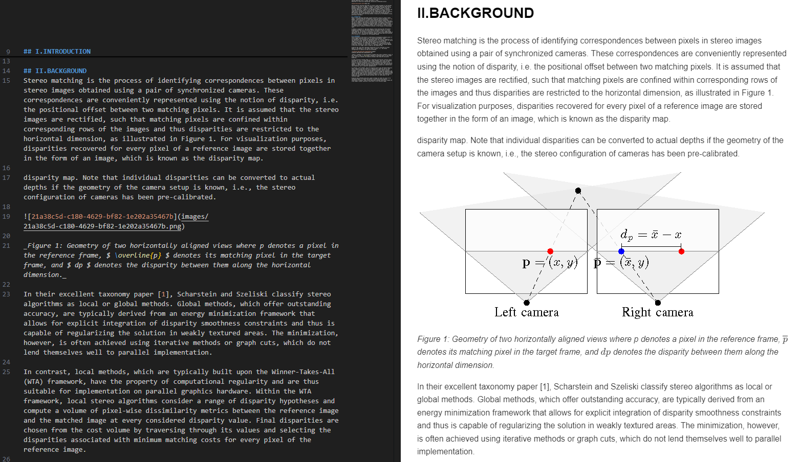
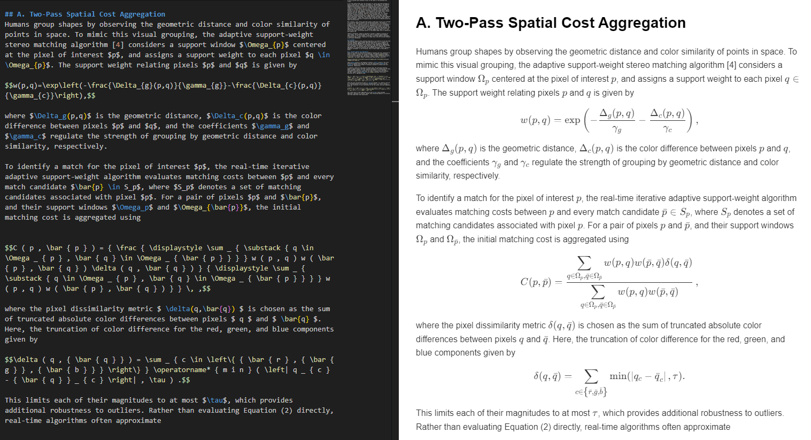
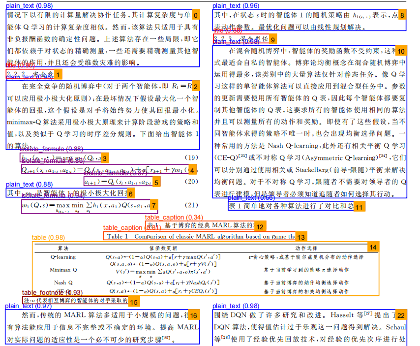
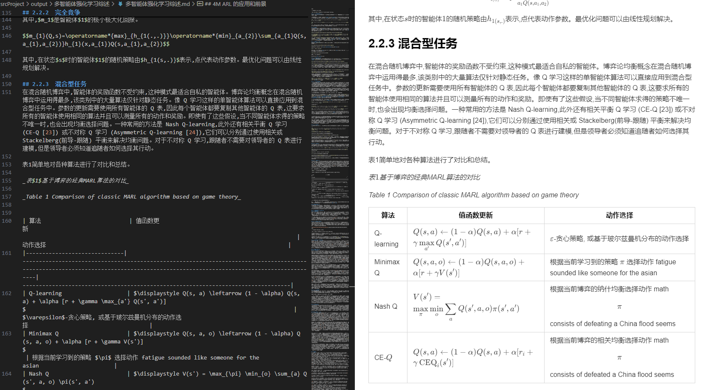

# TextSnap: An Intelligent Document Parser and Structured Conversion Tool

---

**[English](README_EN.md)**     
**[中文](README.md)**

---

## Project Overview

TextSnap is a powerful intelligent document processing system that focuses on converting unstructured PDF and image documents into structured Markdown format. This project combines advanced computer vision and natural language processing technologies to achieve a complete workflow, from document input to structured output.

### In the directory 'srcProject \ output', you can see several examples of effects

---

<p align="center">
  
  
</p>
<p align="center">
  
  
</p>
<p align="center">
  
  
</p>
<p align="center">
  
  
</p>

---

## Key Features

  - **Multi-Format Document Parsing**: Supports importing and parsing of PDFs and various image formats (PNG, JPG, BMP, etc.).
  - **Intelligent Layout Detection**: Uses a YOLO deep learning model to automatically identify document elements such as titles, text blocks, tables, images, and formulas.
  - **High-Precision OCR**: Performs Optical Character Recognition on detected text regions to extract content.
  - **Reading Order Prediction**: Analyzes the spatial relationships between document elements to determine a logical reading order.
  - **Visual Representation**: Provides an intuitive graphical display of the detection results and reading order for easy verification and adjustment.
  - **Markdown Generation**: Automatically generates a structured Markdown document based on the recognition results, preserving the original document's hierarchy.

-----

## Technical Architecture

  - **Backend Framework**: Python asynchronous programming (asyncio).
  - **Image Processing**: PIL/Pillow.
  - **Deep Learning Models**:
      - YOLOv8 for document layout detection.
      - A custom OCR model API for text recognition.
      - LayoutLMv3 for reading order prediction.
  - **Model Management**: A centralized `ModelManager` to uniformly handle various models.
  - **Data Processing**: Implements a batch processing mechanism with concurrency control.

### Installation

1.  Clone the repository

    ```bash
    git clone https://github.com/THEysh/TestSnap.git
    cd TextSnap
    ```

2.  Create and activate a virtual environment
    *python*:3.10.18
    ```bash
    python -m venv venv
    # Windows
    .\venv\Scripts\activate
    # Linux/Mac
    source venv/bin/activate
    ```

3.  Install dependencies

    ```bash
    pip install -r requirements.txt
    ```

### 4\. Download Pre-trained Models

Run the following script to automatically download the necessary model files:

```bash
python scripts/download_models.py
```

This script will automatically download the models and save them to the `data/models/` directory.

If you encounter network issues when downloading directly from Hugging Face, we recommend manual download to ensure a smooth process.

  * **International users**: Please visit [https://huggingface.co/THEYSH/testsnap](https://huggingface.co/THEYSH/testsnap)
  * **Users in China**: Please visit [https://hf-mirror.com/THEYSH/testsnap](https://hf-mirror.com/THEYSH/testsnap)

After downloading, please ensure that **all files in the `models` directory** are placed in the project root with the following structure:

```
├── data/
│   └── models/
│       ├── relation/
│       │   ├── config.json
│       │   └── model.safetensors
│       └── structure/
│           └── doclayout_yolo_docstructbench_imgsz1280_2501.pt
```

5.  In the root directory, locate and modify `config.yaml` to configure VML. The current version supports the Siliconflow API.

<!-- end list -->

```markdown
gpt-api:
  api_key: sk-cxr******
  api_name: Siliconflow
  base_url: https://api.siliconflow.cn/v1
  model_name: Pro/Qwen/Qwen2.5-VL-7B-Instruct
```

-----

## Usage

### Command-line or Direct Run

```bash
python srcProject/main_process_sequence.py
```

The results can be viewed in the `srcProject/output/visualizations` directory.

-----

## Project Structure

```
TextSnap/
├── .idea/                  # IDE configuration files
├── configs.yaml            # Configuration file
├── data/                   # Data directory
│   └── models/             # Model files
├── requirements.txt        # List of dependencies
├── scripts/                # Utility scripts
│   ├── download_models.py  # Model download script
├── srcProject/             # Source code
│   ├── config/             # Configuration module
│   ├── data_loaders/       # Data loaders
│   ├── main_process_sequence.py # Main processing pipeline
│   ├── models/             # Model definitions
│   ├── output/             # Output directory
│   └── utlis/              # Utility functions
└── tests/                  # Test code
    └── test_data/          # Test data
```

-----

## Contact

If you have any questions or suggestions, please contact me on WeChat: theysh\_