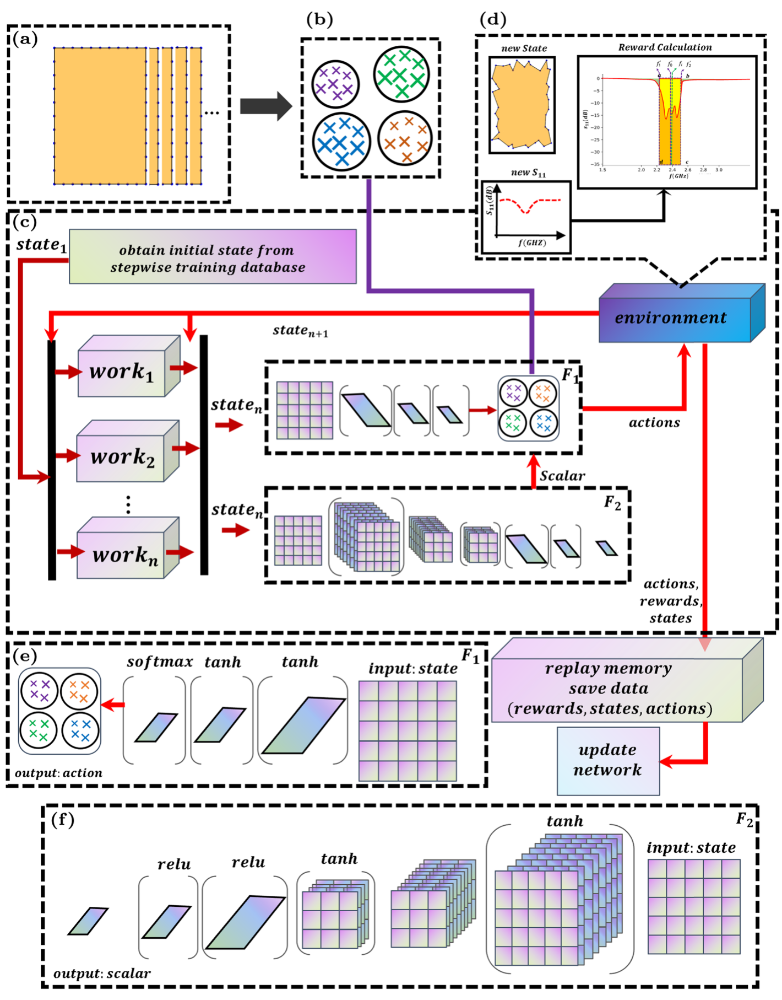
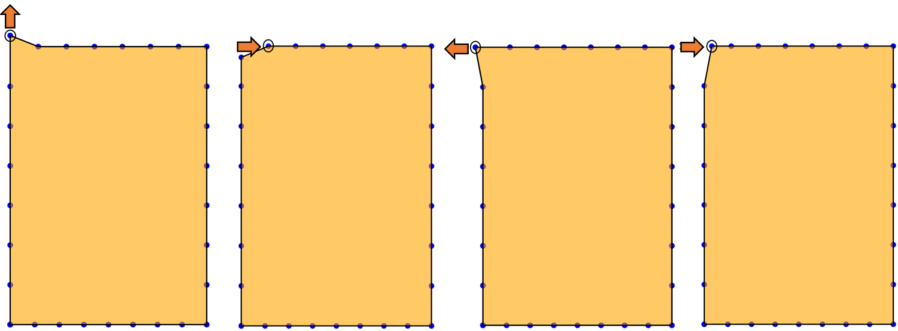
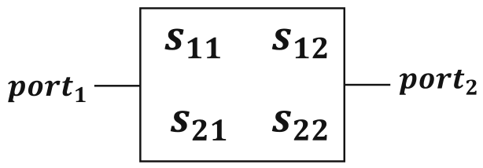
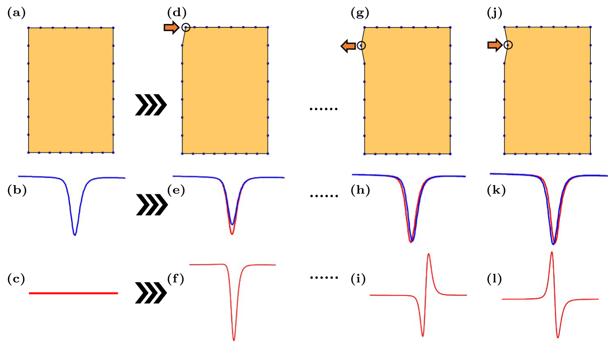
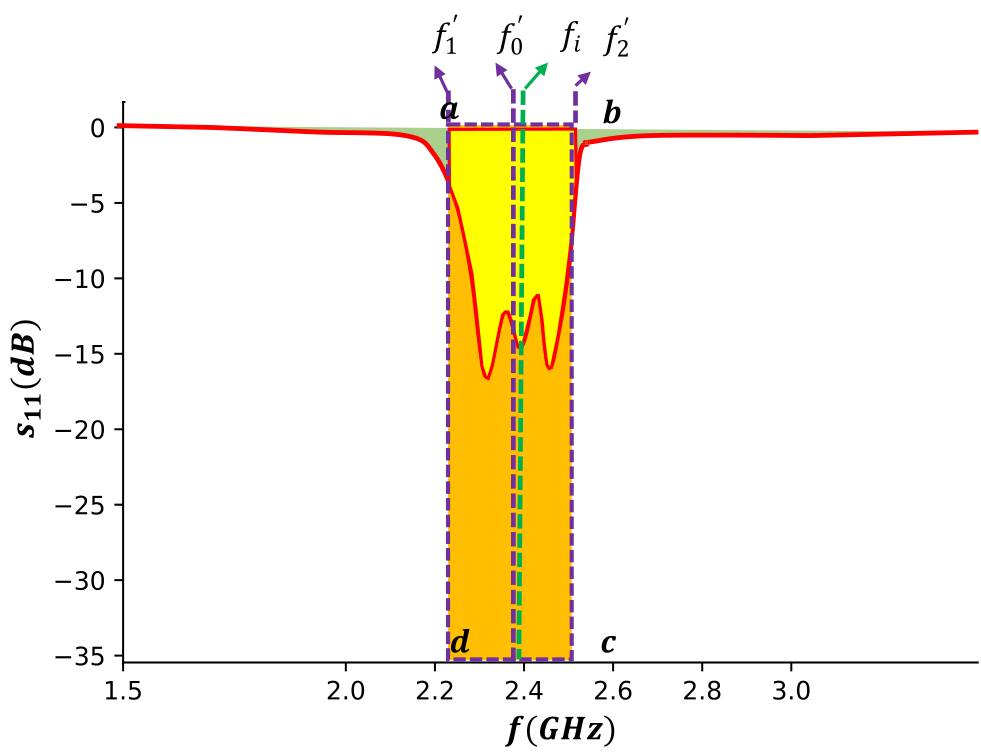
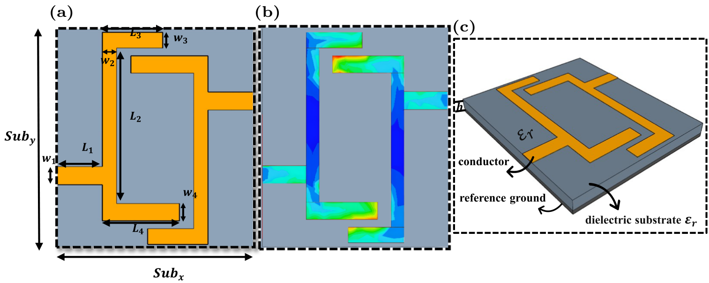
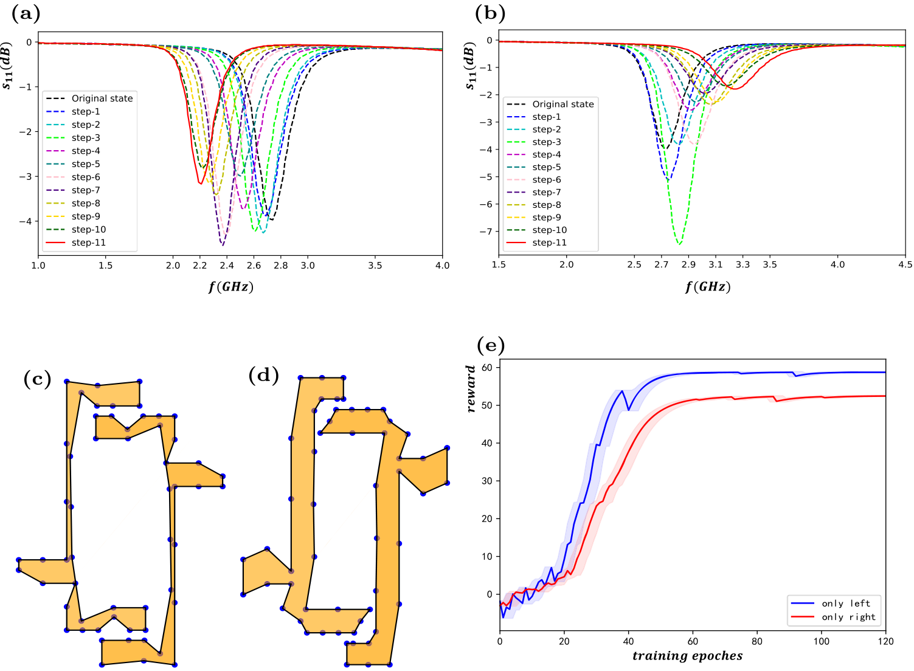
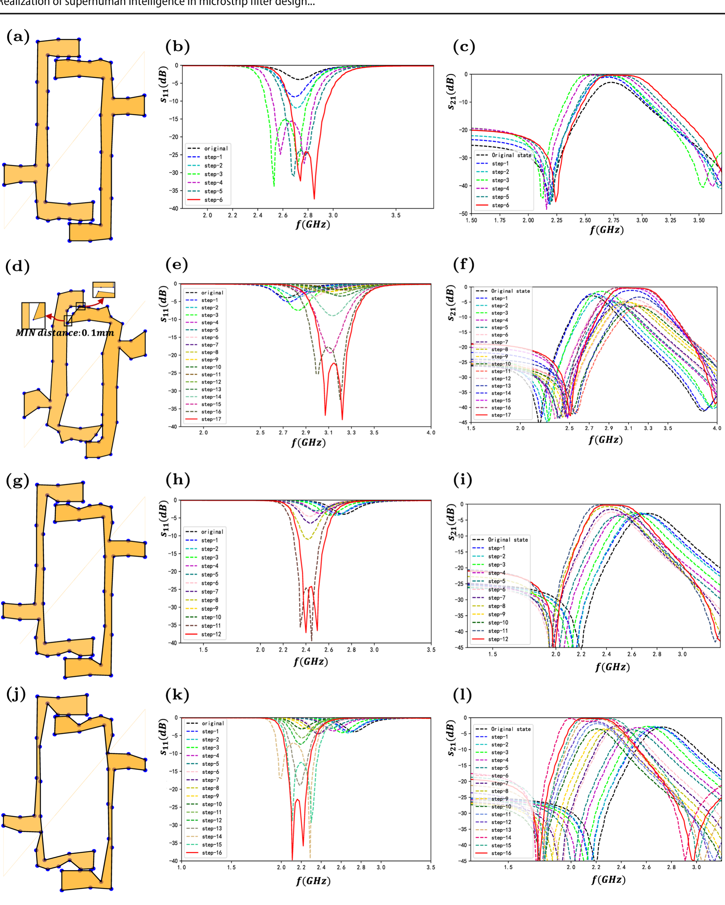
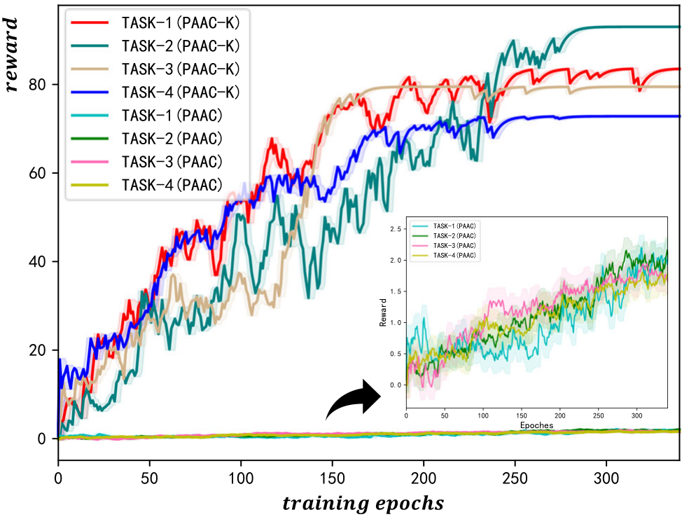

## Realization of superhuman intelligence in microstrip filter design based on clustering-reinforcement learning
Sheng-Hui Yang^{1,2} · Xiao-Bin Liu^{1,2}iTian-Jian Tan^{1,2} · Lei Zhang^{1,2} · Chang Su^{1,2} · Huan-Fu Zhou^{1,3} · Xiao-Lan Xie^{1,2}

Accepted: 11 April 2023 © The Author(s), under exclusive licence to Springer Science+Business Media, LLC, part of Springer Nature 2023

## Abstract
Microstrip filters are widely used in signal processing because of their light weight, compact structure and high reliability. Designing these filters is very time consuming, and a designer generally needs much knowledge of electromagnetic theory. In recent years, artificial intelligence (AI) technology has been used to accelerate the design process. However, current AI models retain the human design mindset (adopt a regular structure) and thus cannot be applied to the automatic design of irregular structures. We proposed a clustering-reinforcement learning model named parallel advantage actor-critic with K-means (PAAC-K). The PAAC-K model is based on a reinforcement learning model, in which the size of the overlapping area is used as the reward function, and a clustering algorithm was added to extract characteristics for learning. We used the stepwise training method to avoid repeated exploration in a design with different frequencies. The PAAC-K model realized superhuman intelligence that automated the design of irregular structures, which was proven with four application examples. This work presents an AI model and a design mindset for irregular structures, which is of great significance in promoting the development of filter devices.

Keywords Microstrip filter · Parallel advantage actor-critic · Reinforcement learning, K-means · Electromagnetic simulation

## 1 Introduction
Filters are frequency selectors that allow the specific frequency components of a filter to pass through or eliminate the signal at a particular frequency. As an essential type of filter, microstrip filters, whose advantages include their lightweight, compact structure and high reliability, have been widely used in signal processing. The performance of filters has an important influence on signal processing systems. However, filters [1–3] have highly complex relationships with physical size parameters. For example, multivariate, nonlinear, and strongly coupled characteristics are usually

analysedusingcomputer-aided design(electromagnetic simulation tools). Electromagnetic(EM) simulations are based on Maxwell’s system of equationsandsolved by numerical calculation methods. Examples include the method of moments  [4] and the finite element method [5]. Moreover, the higher the meshing density in the numerical analysis methods, the more intensive computation [6]. Manually tuning physical parameters to optimize filter performance using EM wave theory is tedious and complex. Artificial neural networks (ANNs), such as those in [7-9],have been found to be robust modelling method substitutes to EM/physics models. This supervised learning approach still has the disadvantage that human involvement is necessary to extract the trainingdata. For designs, engineers must have high theoretical knowledge of electromagnetic waves to find physical dimension parameters that meet design standards, and adjusting parameters by the sweep frequency is time consuming. This process is usually designed to fit a specific size, which does not account for the optimal circuit performance.

A high-performance filter with many action spaces makes it difficult to obtain valid results directly using reinforcement learning. One of the reasons is that reinforcement learning

is highly dependent on the input of the policy/value function. Learning is slow and convergence within a limited time is difficult if a massive amount of information with no typical characteristics is used. We proposed a clustering reinforcement learning model named parallel advantage actor-critic with K-means (PAAC-K) in our work. This model can extract filter characteristics and effectively reduce the action space. The PAAC-K model achieves an end-to-end closed-loop training process of designing, simulating, and optimizing. The model is an assembled reinforcement learning model used to design irregular filters automatically, which was proven with four application examples.

## 2 Related work
As computing power has rapidly increased, artificial intelligence has expanded at an unprecedented rate in recent years. Many researchers have used this method to solve problems in relevant fields [10]. A neural network-based structure parameter estimation approach was used to optimize the structures of BPFs presented by Dai [11]. The designed band-pass lumped circuits were accurately divided into four basic blocks, eliminating the tedious work of manual optimization. Yahya [12] designed a high-performance microstrip duplexer using an artificial neural network (ANN) for improved band-stop characteristics. Salehi [13], using an ANN and an adaptive neuro-fuzzy inference system (ANFIS), designed a subsystem consisting of a microstrip bandpass filter and microstrip low-noise amplifier (LNA). Luo [7] proposed a convolutional neural network with a transfer function for microstrip filter electromagnetic (EM) modelling. Na [14] proposed an algorithm to further reduce the amount of training data through an adaptive sampling process, and demonstrated it with a microwave modelling example. Pinchuk [15] designed and trained a convolutional neural network (CNN). CNN-based direction-of-origin (DoO) filters are superior to existing source direction filters in a range of metrics. The multilayer perceptron feedforward back propagation neural network (MLPFFBP-ANN) presented by Singh [16] was utilized to construct a neural network model and judge the bandwidth of a microstrip antenna. Through several experiments, Sharma [17] used a Gaussian process regression (GPR) model and proved that the fabricated antenna performance is nearest to that designed and predicted by GPR. Both the literature mentioned above and the traditional training methods in neural networks require manual involvement in data extraction and are based on a specific structural improvement. The results by the method depend on the training data, which are extracted manually before the experiment. As there

are not sufficient data to support the network model, the engineer's requirements are not met. When the structure of the filter is changed, the data has to be extracted manually again, which is tedious. This limitation makes it difficult to generate a paradigm model.

In addition to the machine learning and neural network methods mentioned above, reinforcement learning (RL), where an agent learns in an interactive environment, is used by researchers. Reinforcement learning is a paradigm and a machine learning approach designed to learn strategies to maximize rewards or achieve specific task targets in agent interactions with the environment. Unlike supervised learning, reinforcement learning does not require preliminary data but requires interaction between the environment and the actors. Sophisticated reinforcement learning algorithms have superior intelligence that can be used to solve complex problems. For example, there are different applications in computer vision [18–21], machine translation [22–24], natural language processing [25–28], data mining [29–34], drug design [35–37], board games [38–40], etc. In the field of microwave integrated circuits (MWICs), reinforcement learning algorithms are one way to automate design. Liu proposed a relationship-based MWIC design network. This design process is transformed from the manual extraction of parameters to the direct interaction of an agent with its environment. The approaches proposed in the literature further reduce manual participation but also have shortcomings.

1.When designing circuits of different frequencies, the agent will repeatedly explore the central frequencies of the circuits sufficiently.
2.If the training queue is not empty and the model is updated, learning will no longer be policy-based (experience at this point comes from the old policy) and causes asynchronous training instability [41, 42]. Our work improved the above shortcomings.

## 3 Proposed model
## 3.1 K-means
K-means is one of the most commonly used unsupervised learning algorithms to resolve multiple clustering problems. $X=\left\{x_{1}, \ldots, x_{n}\right\}$ a dataset in a $d$-dimensional Euclidean space $\mathbb{R}^{d} . z=\left[z_{ik}\right]_{n \times c}$, where $z_{ik}$ is a binary variable (i.e., $z_{ik} \in 0,1$ ). $A=\left\{a_{1}, \ldots, a_{c}\right\}$ is the $c$ cluster center. If $x_{i}$ belongs to the $k$-th $(k=1, \cdots, c)$ cluster, the k-means objective function is $J(z, A)=\sum_{i=1}^{n} \sum_{k=1}^{c} z_{ik} \|x_{i}-a_{k}\|^{2}$. The objective function $J(z, A)$ iterated for minimiz

the $k$-mean algorithm. The iterative formula for updating the cluster center is shown below $[43]$.

$$a _ { k } = { \frac { \sum _ { i = 1 } ^ { n } z _ { i k } x _ { i j } } { \sum _ { i = 1 } ^ { n } z _ { i k } } }$$

$$z_{i k} = \begin{cases} 1 & \text { if } \| x_{i}-a_{k} \|^{2}= min _ { l \leqslant k \leqslant c } \| x_{i}-a_{k} \|^{2} \\ 0 & \text { otherwise } \end{cases}$$

where $|x_{i} - a_{k}|$ is the Euclidean distance between data $x_{i}$ and the cluster center $a_{k}$.

## 3.2 Reinforcement learning
When faced with a problem, different actions are adopted to influence the outcome by perceiving the environment and maximizing the benefits of learning by interaction, which is also referred to as reinforcement learning. Current reinforcement learning algorithms utilize neural networks to extract high-dimensional characteristics from observed data and represent their strategies or value functions as function approximators.

The agent receives state $s_t$ at each time step $t$, and selects an action $a_t$ from a collection of actions $\mathcal{A}$ according to the policy model $\pi$, where $\pi$ is a map of states to actions $a_t$ the next state $s_{t+1}$ and scalar reward $r_t$ as return. The whole process runs continuously to maximize rewards $R_t = \sum_{k=0}^\infty \gamma^k r_{t+k}$, in which $\gamma$ is the discount factor $(0 < \gamma < 1)$ and $r_t$ is the reward at step $t$. In value-based model-free reinforcement learning methods, the action-value function is represented by a neural network and other function approximators.

## 3.2.1 A2C and A3C
A2C (Advantage Actor-critic) combines policy-based and value-based approaches, which maintain a policy $\pi(a_t | s_t ; \theta)$ and an estimate of the value function $V(s_t ; \theta)$. Policies $\pi(a_t | s_t ; \theta)$ and $V(s_t ; \theta)$ are mainly defined as the policy network and critic network, respectively. $\theta$ can be optimized by the gradient ascent method as follows [44].

$$\nabla \bar{R}_{\theta} \approx \frac{1}{N} \sum_{n=1}^{N} \sum_{t=1}^{T_{n}} \left( r_{t}^{n} + V_{\pi} \left(s_{t+1}^{n}\right) - V_{\pi} \left(s_{t}^{n}\right) \right) \nabla \log p_{\theta} \left(a_{t}^{n} \mid s_{t}^{n}\right)$$

A2C can learn from only one work with the environment, which differs from A3C (Asynchronous Advantage Actor-critic). A3C operates asynchronously with a global network and multiple branch networks learning from multiple works. Each branch network can be understood as a replica of the global network. Asynchronous training updates

multiple branch network parameters to uninterruptedly update the global network parameters. The updates performed can be seen below [45].

$$\nabla_{ \theta^{\prime} } \log \pi \left( a_{ t } \mid { s_{ t } } ; { \theta^{\prime} } \right) { A } \left( { s_{ t } } , { a_{ t } } ; { \theta } , { \theta_{ v } } \right) + \beta \nabla_{ \theta^{\prime} } { H } \left( \pi \left( { s_{ t } } ; { \theta^{\prime} } \right) \right)$$

$\beta \nabla_{\theta^{\prime}} H\left(\pi\left(s_{t} ; \theta^{\prime}\right)\right)$ is the entropy, which can increase the exploration of the environment and prevent premature convergence leading to suboptimal results. $A\left(s_{t}, a_{t} ; \theta, \theta_{v}\right)$ is the advantage function, which is given as follows [45]

$$A \left(s_{t},a_{t};\theta,\theta_{\nu}\right)=\sum _{i=0}^{k-1} \gamma^{i}r_{t+i}+\gamma^{k}V\left(s_{t+k};\theta_{\nu}\right)-V\left(s_{t};\theta_{\nu}\right)$$

The parameter ${\theta}_{v}$ of the value network is then updated by the gradient descent of

$$\nabla_{\theta_v}\left[\left(\sum_{i=0}^{k-1}\gamma^i r_{t+i} + \gamma^k V\left(s_{t+k}; \theta_v\right) - V\left(s_t; \theta_v\right)\right)^2\right]$$

## 3.2.2 Parallel Advantage Actor-Critic (PAAC)
A general framework for deep reinforcement learning was proposed by Clemente [42], and multiple participants can be trained synchronously on one machine.

Gradients in PAAC are calculated using mini batches of experiences. Multiple environment instances are trained in parallel and may explore different states at any given time. The advantage is reducing the relevance of the state encountered and contributing to stable training $[45]$.

The updated formulas for policy gradients $\nabla_{\theta}^{\pi}$ and value gradients $\nabla_{\theta}^{V}$ are shown below [42]

$$\nabla _ { \theta } ^ { \pi } \approx \frac { 1 } { { n _ { e } \cdot t _ { \max } } } { } ^ { \displaystyle \sum _ { e = 1 } ^ { { n _ { e } } } \sum _ { t = 1 } ^ { { t _ { \max } } } } \left( { Q ^ { ^ { \left( { t _ { \max } } - t + 1 \right) } } \left( { s _ { e , t } , a _ { e , t } ; \theta , \theta _ { v } } \right) - V \left( s _ { e , t } ; \theta _ { v } \right) } \right)$$
$$\nabla _ { \theta } \left. \operatorname { l o g } \pi \left( { a _ { e , t } \mid s _ { e , t } ; \theta } \right) + \beta \nabla _ { \theta } H \left( \pi \left( s _ { e , t } ; \theta \right) \right) \right.$$

$$\nabla_{\theta_v}^V \approx \nabla_{\theta_v} \frac{1}{n_e \cdot t_{\max}} \sum_{e=1}^{n_e} \sum_{t=1}^{t_{\max}} \left( Q^{(t_{\max}-t+1)}(s_{e,t}, a_{e,t}; \theta, \theta_v) - V(s_{e,t};\theta_v) \right)^2$$

## 3.3 Parallel Advantage Actor-Critic,
K-means(PAAC-K)
The PAAC-K model consists of a parallel advantage actor-critic, $K$-means, reward functions, and stepwise training.

methods,as shown in Fig.1. The model can qualitatively change the grid parameter matrix for learning and designing irregular structures based on the clustering results.

The role of the clustering algorithm is to cluster the action space, i.e., different directions of movement of grid points, to obtain several typical actions

The role of reinforcement learning is to complete the design task, which depends on the PAAC architecture. PAAC-K is a parallel architecture based on the advantage actor-critic algorithm. Unlike in A3C, there is only one copy of the parameters in PAAC-K, and parameter updates are performed synchronously. The data are collected during the design process without calculating the gradient. Therefore, training instability is avoided and resources are wasted with asynchronous updates. The policy network ($\mathcal{F}_1$) generates the design strategy of the filter, and the critic network ($\mathcal{F}_2$) evaluates the strategy. Using the exploration mechanism in

training aims to limit the probability distribution of policy $\pi (a_t\ |\ s_t; \theta)$, which is more rational in that different actions have a better chance of being adopted.

Stepwise training is a method that can greatly reduce the agent’s exploration space. Reward functions help the agent find the circuit solution.

As shown in Fig. 1, $n$ group environments are trained simultaneously and maintained on a single device, with all work performed through interactions with the environment.

The whole environment is an electromagnetic computing process. It is calculated by invoking the electromagnetic simulation-API whenever the grid in Fig. $1\mathrm{d}$ changes in any direction. The data generated by work performed through the environment are stored in replay memory, which is used to update the policy and value networks.

_Fig. $1 \ \mathrm{PAAC-K}$ architecture. $\mathbf{a}$, Dataset of the circuit grid parameter matrix. $\mathbf{b}$, Clustering results. $\mathbf{c}$, Environment interaction process. $\mathbf{d}$, New state, new $S_{11}$ curve and reward calculation. $\mathbf{e}$, $F_{1}$ is the policy network. The circuit grid parameter matrix is input, and a new action is returned. $\mathbf{f}$, $F_{2}$ is a value network. The circuit grid parameter matrix is input, and a value scalar is returned_

Realization of superhuman intelligence in microstrip filter design...

_Fig.2 Single grid change_

## 3.3.1 Clustering
## (a) Circuit Grid Parameter Matrix
The circuit grid parameter matrix consists of multiple grid points, each with coordinates. In this section, the parameter matrix describes a rectangle (Fig. 2) for the schematic. Three or more grid points are connected sequentially to construct a polygonal closure interval that describes the irregular structure. Each grid point has four directions of movement (up, down, left, and right). Polygon materials are usually conductors welded to a dielectric substrate.

## (b) Characteristics Clustering
The S-curve is an evaluation metric in filter design, and our model is based on the S-curve for learning. The performance of the transmission line circuit is studied based on the S-parameter, which can be equated to a two-port network. The S-parameter matrix of the two-port network is shown in Fig. 3, where $S_{11}$ (reflected power/insertion power) is the reflection loss and $S_{21}$ (output power/input power) is the insertion loss. A connection is created between the S-parameter and circuit grid parameter matrix, and the characteristics of the circuit are clustered based on the S-parameter.

As shown in Fig. 4, a single grid point has four shift directions. The $S_{11}$ curve based on iterating each grid point shift $0.2$ mm in four directions is calculated by invoking the electromagnetic simulation-API as a clustering dataset. The new circuit grid parameter matrix after a single grid point shift of $0.2$ mm is shown in Fig. 4 d, g and j. The new and original $S_{11}$ curves are shown in Fig. 4 e, h and k. The difference between

_Fig. 3 S-parameter matrix of the two-port network_

the $S_{11}$ curves(new curve and original curve without action) is shown in Fig. 4 f, i and l.

## (c) Add Clustering Algorithm Reduce Exploration
Space
The $S_{11}$ curve is used as the evaluation index of the filter and calculated by invoking the electromagnetic simulation-API whenever the grid points move in any direction. As the number of grid points increases, the larger the number of grid points is, the greater the number of circuit solutions. Grid changes cause the filter to change and perform differently. For instance, the structure has 29 grid points, each of which can perform 4 operations (up, down, left, and right). Then, the agent action space is 116($29 * 4$). It is difficult for the traditional reinforcement learning algorithm to converge within the task objective when there is an excessive amount of exploration space. Without clustering, the reinforcement learning algorithm has difficulty converging when there is too much action space. However, the action space can be effectively reduced by clustering the difference (result of the actions) of $S_{11}$ curve. Details can be seen in Fig. 4.

Based on the K-means algorithm, the quality of the cluster centre is essential to the clustering quality [43]. As shown in Fig. 5, the difference between the $S_{11}$ curve is used as the initial value for clustering. When the grid points move in any direction, the electromagnetic simulation-API will be automatically invoking to calculate the $S_{11}$ curve. Finally, four clustering results are obtained after computing all grid points (Fig. 4) based on the differential $S_{11}$ curves and the initial values (Fig. 5). These results include $S_{11}$ shifting downwards, leftwards, rightwards, and upwards. The filter design task requires the $S_{11}$ curve to be shifted downwards within the specified frequency band without being shifted upwards. In other words, the upward shift of the $S_{11}$ curve will lead to a decrease in filter performance. Therefore, the upward shift clustering results were excluded to ensure the performance of the filter.

In the reinforcement learning process, the state is defined as the grid parameter matrix, and the rewards can be seen in Section 3.3.2b. When in state $\{s_{i}, s_{i+1} \dots, s_{n}\}$, any action by the policy model $\pi(a_{i}\mid s_{i};\theta)$ makes the rewards

_Fig. 4 S-parameter curve clustering instruction. a-c. The circuit grid parameter matrix in the original state is shown in a, the $S_{11}$ curve in the original state is shown in b, and the differential $S_{11}$ curve is shown in c. d,g and j. Circuit grid parameter matrices in the new state after a single grid point shift. e,h and k. The red curve is $S_{11}$ in the new state, and the blue curve is $S_{11}$ in the original state. f,i and l. The differential $S_{11}$ curve_

$\left\{r_{i}, r_{i+1} \ldots, r_{n}\right\}$ negative, which indicates that it is difficult for the agent to explore a better solution. An “end” action was added to a typical action cluster to avoid the disadvantages mentioned in our work. The agent can choose to end the circuit design in any state. If the agent selects the “end” action in state $s_{i}$, its reward $r_{i}=0$ in state $s_{i}$ and the end of an iteration.

For example, the upward shift clustering results of the $S_{11}$ curve has been excluded, and an “end” action has been added. The computational space requirements will be reduced from $116^{n}$ to $4^{n}$. A clustering algorithm is added to reduce the action space of the filter to achieve fast convergence in adequate time. The space is greatly reduced in this method and is the highlight of filter design automation.

## (d) Circuit Characteristic Extraction
Circuit characteristics are clustered into $c$ different clusters of $G_{i} \, (i = 1, 2, \ldots, c)$ by using a partition-based k-means algorithm with $n$ vectors $x_{i} \, (i = 1, 2, \ldots, n)$ as input ($n$ is related to $S_{11}$). The Euclidean distance between the vector $x_{i}$ of the selection group $G_{i}$ and the cluster centre

_Fig. 5 Four clusters based on the differential $S_{11}$ curves_

$C_{i}=a_{1},a_{2},a_{3},...,a_{c}$ is calculated as follows [43]:

$$J \left( {G_i, C_i} \right) = \sum\limits_{i = 1}^n {\sum\limits_{k = 1}^c {z_{ik} } } { \left\| {{x_i - {a_k}}} \right\|^2}$$

The distance from each object to each cluster centre is compared, and $c$ objects are assigned to the nearest cluster centre $C_i$.

## 3.3.2 Reinforcement learning
The reinforcement learning part of the PAAC-K model is composed of actors and critics \cite{8357207}. When the critic judges an action as beneficial, the agent increases the probability of the action occurring. Conversely, the probability decreases.

The algorithm interacts with the environment several times. The value function $V\left(s_{t};\theta_{v}\right)$ is estimated based on the environment's reward for updating the policy model $\pi\left(a_{t}\mid s_{t};\theta\right)$. Each work shares one policy $\pi\left(a_{t}\mid s_{t};\theta\right)$. The advantage function $A\left(s_{n,t},a_{n,t};\theta,\theta_{v}\right)$ and value $Q$-function

with the $n$-step are defined as follows

$$A \left( s_{n,t},a_{n,t};\theta ,\theta _{v} \right) =Q^{(k)}\left( s_{n,t},a_{n,t};\theta ,\theta _{v} \right) -V\left( s_{n,t};\theta _{v} \right)$$

$$Q ^ { ( k ) } \left( s _ { n , t } , a _ { n , t } ; \theta , \theta _ { v } \right) = \sum _ { i = 0 } ^ { k - 1 } \gamma ^ { i } r _ { t + i } + \gamma ^ { k } V ^ { \pi } \left( s _ { t + k } ; \theta _ { v } \right)$$

$n$ parallel tasks are set up. $s_{n,t}$ and $a_{n,t}$ are represented by the state and action in environment $work_{n}(1 < n < N_{n})$, respectively. The network performs gradient updates by small batch sampling from the replay memory. $n$ works interact with the environment to generate batches size of $N \ast T_{max}$. The updates of policy gradient $\nabla_{\theta}^{\pi}$ are presented in the equation below [42]:

$$\nabla _ { \theta } \pi \approx \frac { 1 } { N T _ { \max } } \sum _ { n = 1 } ^ { N } \sum _ { t = 1 } ^ { T _ { \max } } A \left( s _ { n , t } , a _ { n , t } ; \theta , \theta _ { v } \right) \nabla _ { \theta } \log \pi \left( a _ { n , t } \mid s _ { n , t } ; \theta \right) + \beta \nabla _ { \theta } H \left( \pi \left( a _ { n , t } \mid s _ { n , t } ; \theta \right) \right)$$

$$\beta \nabla _ { \theta } H ( \pi \left( a _ { t } \mid s _ { t } ; \theta \right) )$$ is the entropy of policy model $$\pi \left( a _ { t } \mid s _ { t } ; \theta \right)$$, increasing exploration and prevent the model from falling into a local optimum. The value gradient $$\nabla _ { \theta _ { v } }$$ is updated as follows [42]:

$$\nabla _ { \theta _ { v } } ^ { V } \approx \nabla _ { \theta _ { v } } \frac { 1 } { N T _ { \max } } { \sum _ { n = 1 } ^ { N } } \sum _ { t = 1 } ^ { T _ { \max } } { \left( Q ^ { { \left( T _ { n } - t + 1 \right) } } { \left( s _ { n , t } , a _ { n , t } ; \theta , \theta _ { v } \right) } - V { \left( s _ { n , t } ; \theta _ { v } \right) } \right) } ^ { 2 }$$

(a)PAAC-K Parameters The complete network architecture is shown in Fig. $1$e and $1$f. PAAC-K consists of a policy network $F_{1}$ and a value network $F_{2}$. $F_{1}$ and $F_{2}$ uses the circuit grid parameter matrix as input, $F_{1}$ returns an action in the current state, and $F_{2}$ returns a value evaluation (scalar) according to function $V{(s_{t}; \theta_{v})}$.

The $F_1$ network is a multilayer perceptron (MLP) with 128 hidden cells. The input and hidden layers of the MLP connect to the tanh activation function, while the output layer connects to the softmax activation function. The policy model $\pi\left(a_t \mid s_t ; \theta_p\right)$ returns the action with the highest probability distribution in vector form. The $F_2$ network firstly follows a convolutional layer for extraction characteristics. It is followed immediately by a maximum pooling layer and another convolution layer. Each convolutional layer connects the tanh activation function, the stride is 1, the kernel size is $5*5$, and the padding is default to 0 to prevent information loss. An MLP with 128 hidden cells is introduced after the convolutional layer. The input and hidden layers of the MLP connect the relu activation function, while the output layer has no activation function and returns the value scalar directly. The

circuit grid parameter matrix is processed by the \textit{Z} score standardized before being fed into the neural network to improve the velocity of the gradient descent solution. The standardized formula is as follows:

$$y _ { i } = { \frac { x _ { i } - { \bar { x } } } { \operatorname { s t d } ( x ) } }$$

## (b)Reward
The design performance of the filter is generally related to the centre frequency ${f'_{0}}$, frequency band ${f'_{1}}\sim{f'_{2}}$, reflection loss, insertion loss, etc. Therefore, when setting the reward, the defined function should also be related to the above. The two steps are based on the stepwise training method. The first step is adjusting the centre frequency, and the second step is adjusting the reflection loss. The two reward functions, $R'$ and $R''$, are implemented for the circuit design.

As shown in Fig. 6, the central frequency of the target is $f_0'$, the bandpass band range of the target is $f_1' \sim f_2'$, and the centre frequency of the current state $s_i$ is $f_i$. Reward $r_{1,i}$ satisfies the equation as follows:

$$r_{1,i}=-\left\lvert f'_0-f_i\right\rvert\ast\gamma$$

$γ$ is the weight coefficient in the equation above. The smaller the distance between $f_i$ and $f_0'$, the greater the reward. $R'$ is the difference between the current and previous states. Then, $R'$ is calculated as follows:

$$R^{\prime}=r_{1,i}-r_{1,i-1}$$

The yellow shadowed region $A_{i}$ in state $s_{i}$ is formed by overlapping the quadrilateral $abcd$ and $S_{11}$ curves, which is

_Fig.6 Reward function_

associated with $S_{11}$ and reward $r_{2,i}$ and satisfies the equation as follows:

$$A_{i}={\displaystyle \sum\limits_{j=1}^{n}}S_{j}$$

$$r_{2,i}=\sum_{j=1}^{n}S_{j}*\beta_{j}$$

$S_j$ in the above equation is the split part of $A_i$ in the overlap region. When the location of the $S_j$ area is close to the centre frequency and the $S_{11}$ curve is close to negative infinity, the weighted $\beta_j$ is larger, giving a higher positive reward. Similarly, $R''$ is the difference between the current and previous states. Then, $R''$ is calculated as follows:

$$R^{\prime \prime} = r_{2,i} - r_{2,i-1}$$

## 3.3.3 Stepwise training
A database is created, and it stores information regarding different frequencies. The initial state is selected based on the current reward $R'$ in state $s_i$. The formula for $R'$ is calculated by Formula $16$. The smaller the distance from the target frequency in state $s_i$ is, the larger the reward.

Consists of two parts. (1) The agent adjusts the circuit grid parameter matrix to transform the centre frequency and collects a dataset with different centre frequencies. (2) The circuit grid parameter matrix with the closest target frequency is extracted from the dataset and set to the initial state. Subsequently, the agent learns to adjust the matrix to complete the filter design.

In designing filters of different frequencies, the stepwise training method avoids repetitive detection of central frequencies, reducing the agent's exploration space.

## 3.3.4 Pseudocode of PAAC-K
The pseudocode for the PAAC-K is given in algorithm 1.

## 4 Application examples
## 4.1 Background of the microstrip filter design
In the traditional method, any filter can be designed from the original low-pass prototype based on the frequency. A suitable filter structure is obtained by combining performance indicators through frequency variations and the transformation of individual components. In this process, a low-pass filter prototype is converted into a high-pass, bandpass, or bandstop filter. Then, a two-port network [46] analysis and

_Algorithm 1 Parallel Advantage Actor-Critic with K-means._

Algorithm 1 Parallel Advantage Actor-Critic with K-means

Select c samples as the initial clustering centers $C_i$ $\{a_1, a_2, a_3, \dots, a_c\}$

Get n vectors $x_i$ ($i = 1, 2, \dots, n$)

1: while $C_i = \{a_1, a_2, a_3, \dots, a_c\}$ is changing do

2: for $x_1$ to $x_n$ do

3: for $a_1$ to $a_c$ do

4: Calculate the distance from $x_i$ to $C_i = \{a_1, a_2, a_3, \dots, a_c\}$

5:
$z_{ik} = \begin{cases}
1 & \text{if }\|x_i - a_k\|^2 = \min_{l \leq k \leq c} \|x_i - a_k\|^2 \\
0 & \text{otherwise}
\end{cases}$

6: $J(G_i, C_i) = \sum_{i=1}^n \sum_{k=1}^c z_{ik} \|x_i - a_k\|^2$

7: end for

8: end for

9: for $a_1$ to $a_c$ do

10: Recalculate its clustering center $C_i = \{a_1, a_2, a_3, \dots, a_c\}$

11: Update $C_i$ using $a_k = \frac{\sum_{i=1}^n z_{ik} x_{ij}}{\sum_{i=1}^n z_{ik}}$

12: end for

13: end while

14: Instantiate set n of $work_n$ environments

15: Initialize step counter $epochs = 0$ and network weights $\theta$, $\theta_v$

16: Collects data from clustering results as agent's action

17: Get the state $s_1$ using the Stepwise Training method

18: while $epochs < epochs_{\text{max}}$ do

19: Set initial state as $s_1$

20: while $(t < T_{\text{max}})$ and (the agent not selects "end" action) do

21: Sample $a_t$ from $\pi(a_t | s_t; \theta)$

22: Calculate $v_t$ from $V(s_t; \theta_v)$

23: for parallel $work_1$ to $work_n$ do

24: Perform action $a_{t,n}$ in environment $work_n$

25: Observe new state $s_{t+1,n}$ and reward $r_{t+1,n}$

26: end for

27: save(data(rewards,states,actions))

28: end while

29:
$R_{t_{\text{max}} + 1} = \begin{cases}
0 & \text{for terminal } s_t \\
V(s_{t_{\text{max}} + 1}; \theta) & \text{for non-terminal } s_t
\end{cases}$

30: for $t = 1 \to T_{\text{max}}$ do

31:
$R_t = r_t + \gamma R_{t-1}$

32: end for

33: $d\theta = \frac{1}{N \cdot T_{\text{max}}} \sum_{n=1}^{N} \sum_{t=1}^{T_{\text{max}}} (R_{t,n} - v_{t,n}) \nabla_\theta \log \pi(a_{t,n} | s_{t,n}; \theta$

$+ \beta \nabla_\theta H(\pi(s_{n,t}; \theta))$

34:
$d\theta_v = \frac{1}{N \cdot T_{\text{max}}} \sum_{n=1}^{N} \sum_{t=1}^{T_{\text{max}}} \nabla_{\theta_v}(R_{t,n} - V(s_{t,n}; \theta_v))^2$

35: Update $\theta$ using $d\theta$ and $\theta_v$ using $d\theta_v$

electromagnetic wave theory are used to optimize the filter and complete the design.

## 4.2 Hairpin bandpass filter
The hairpin structure [47] is adopted to complete the design of the bandpass filters. This structure uses a polystyrene dielectric substrate material [48] with a dielectric constant of 2.6. A hairpin resonator with a double-barrelled step impedance resonator with a cross-finger structure is an improved half-wavelength coupled microstrip line filter with a more compact structure.

_Fig. 7 Structure of the hairpin bandpass filter. a, Top view of b, The surface magnetic field distribution of the designed filter. c, The structure of the filter_

_Table 1 $\text{Original size of the}$ $\text{hairpin filter (units/mm)}$_

| $Sub_x$ | $Sub_y$ | $h$ | $L_1$ | $L_2$ | $L_3$ | $L_4$ | $w_1$ | $w_2$ | $w_3$ | $w_4$ |
|------|------|------|------|------|------|------|------|------|------|------|
| 23.8 | 28 | 1.0 | 5.6 | 19.8 | 7.2 | 9.2 | 2.3 | 1.7 | 2.2 | 2.0 |

_Table 2 Four task examples with the PAAC-K model_

| Task | Passband/GHz | Center frequency/GHz | Insertion loss/dB | Reflection loss/dB | Filter size$L \ast W$(units/mm) |
|---|---|---|---|---|---|
| 1 | 2.6 ~ 2.9 | 2.75 | > -0.5 | <= -15 | 28*23.8 |
| 2 | 3.0 ~ 3.3 | 3.15 | > -0.5 | <= -15 | 28*23.8 |
| 3 | 2.3 ~ 2.5 | 2.4 | > -0.5 | <= -15 | 28*23.8 |
| 4 | 2.0 ~ 2.3 | 2.15 | > -0.5 | <= -15 | 28*23.8 |

_Fig.8 Clustering results. a-d, Visualization of filters of typical action clusters. e-h, The differential $S_{11}$ curves (new state curve with actions and the original curve without actions)_

_Fig.9  Stepwise training method. a, Training results of the centre frequency with a leftwards shift. b, Training results of the centre frequency with a rightwards shift. c, Circuit grid parameter matrix for Step 11 in Fig. 9a. d, Circuit grid parameter matrix for Step 11 in Fig. 9b. e, Training curve_

The aim of the PAAC-K model in this example is to optimize the hairpin filter according to different tasks. The initial parameters of the hairpin structure are set randomly and regularly, and the performance is far from that of the standard. The hairpin structure initial parameters are shown in Fig. 7 and Table 1.

According to microstrip filter theory [49], the performance of the hairpin filter depends mainly on the size of different physical parameters, including the length, distance between resonators, hairpin arm length, hairpin resonator line width, distance between the double arms of a single resonator and tap position. The disadvantage of the traditional method is that changing the physical parameters indirectly affects the electromagnetic performance. In contrast, the method in this paper uses a clustering algorithm to extract characteristics directly, thus changing the grid matrix based on request. The filter shape mesh is divided for clustering different actions. The agent changes the grid matrix for the design with the neural network model, which establishes the relationships in the circuit grid parameter matrix of the different frequencies. Thus, the relationship of the structure is obtained, and the automatic design of the irregular filter is realized.

We have designed four task examples of hairpin filters with different bandpass frequencies, as shown in Table 2. All work is performed by the agent. The designed centre frequencies are 2.75 GHz, 3.15 GHz, 2.4 GHz, and 2.15 GHz, and the filter size is limited between sub $_x$ and sub $_y$. All parameter settings are based on the design standards

## 4.3 Results and discussion
A visualization of the clustering results is shown in Fig. 8. PAAC-K extracts 4 categories. Increasing the coupling ratio causes a downwards shift of the $S_{11}$ curve (Fig. 8a and e), decreasing the resonant frequency causes a leftwards shift of the $S_{11}$ curve (Fig. 8b and f), and increasing the resonant frequency causes a rightwards shift of the $S_{11}$ curve (Fig. 8c and g).

From the filter design view, the “cluster centre 4” category (Fig. $5$ ) of the filter performance is further away from the target. To achieve better $S_{11}$ performance, underperforming operations are excluded from the typical action cluster.

The number of iteration steps set for training is 11 (Fig. 9), indicating that agents can convert the matrix up to 11 times during training. The centre frequency from 2.70 GHz to 2.2 GHz is achieved by shortening the resonator width and that from 2.70 GHz to 3.2 GHz is achieved by expanding the resonator width. When designing a filter for a task, the agent selects the initial state using the stepwise training method that is closest to the target frequency. See Section 3.3.3 for more information.

In Task 1, the target centre frequency is $2.75\ \mathrm{GHz}$, and the passband frequency is from $2.6\ \mathrm{GHz}$ to $2.9\ \mathrm{GHz}$. The filter’s original state (centre frequency of $2.70\ \mathrm{GHz}$) is shown in Fig. 7. The agent has learned to gradually adjust the coupling coefficient between resonators to reduce the reflection loss of the filter to complete the circuit design. As shown in Fig. 10 a-c, the task objectives are achieved quickly.

_Fig. 10 Filter design flow.a-c, Task 1 design results (a is the circuit grid parameter matrix, b is the $S_{11}$ curve, and c is the $S_{21}$ curve). d-f, Results of Task 2. g-i, Results of Task 3. j-l, Results of Task 4_

_Fig. 11 Comparison of PAAC-K and PAAC in 4 filter design tasks_

In Task 2, the target centre frequency is 3.15 GHz, and the passband frequency is from 3.0 GHz to 3.3 GHz. The filter's centre frequency in Fig. 7 is too far from the design target to be an initial state. As shown in Fig. 10 d-f, the initial state is extracted with the stepwise training method (Steps 1 to 11). This is a process automatically extracted from the database. The agent has learned to broaden the resonator to transfer the centre frequency left to 3.20 GHz. The agent also learns to adjust the coupling coefficient and reduce the reflection loss and insertion loss to complete the filter design (Step 12 to 19).

In Task 3, as shown in Fig. 10 g-i, the centre frequency is transferred to 2.42 GHz from 2.70 GHz, that of the original state (Fig. 7). Similarly, in Task 4, as shown in Fig. 10 j-l, the centre frequency is transferred to 2.17 GHz from 2.70 GHz. The agent has completed the design of both tasks and met the design specifications. The results in any of the four example tasks using a GPU converge within 300 times and 8 hours. A filter with high-performance standards that demonstrate the PAAC-K architecture's advantages is obtained. Without clustering, there are many grid points, solutions, and exploration spaces. The agent has difficulty understanding the filter characteristics. The increasing reward is difficult,

and the algorithm has difficulty converging in adequate time (Fig. 11). The agent selects the “end” action to indicate the end of the current iteration. Note that the agent selects the “end” action because of numerous explorations and finds that opting for other actions is always further away from the goal in the long run, which means a lower rewards. Thus, the agent chooses to end the design. To better understand the agent’s work, a video can be found in the supplementary information.

Based on reinforcement learning theory, the exploration $space$ increases exponentially with the depth of detection. As shown in Table 3, the exploration space rises exponentially as the task’s difficulty grows. In Task 2, the exploration $space$ of the traditional reinforcement learning algorithm is $116^{17}$. Without using the stepwise training method, the exploration $space$ is $4^{17}$. The exploration $space$ of PAAC-K is $4^{11} + 4^{6}$.

## 5 Main contributions
The main contributions of this work: (1) This work presents the PAAC-K model, which can realize superhuman intelligence that automated the filter design of irregular structures. (2) The excessive action space makes it difficult for reinforcement learning algorithms to converge in the filter design task. We used a clustering algorithm to achieve the clustering of the differential $S_{11}$ curves. This approach can effectively reduce the action space, so as to converge quickly. (3) The overlap region size is used as the reward function in reinforcement learning algorithms, which can provide a reference for other types of filter designs, such as low-pass and high-pass filters. (4) We use the stepwise training method to avoid repeated exploration in the different tasks of filter designs.

## 6 Conclusion
This paper presents a parallel model based on clustering-Reinforcement learning named PAAC-K. The model achieves an end-to-end closed-loop training process of designing, simulating, and optimizing. The PAAC-K model is based on clustering results for learning and can be used in the automatic design of irregular structures, which is proven with four$

_Table 3 Exploration space in different tasks_

| Task | Traditional reinforcement learning | Clustering-reinforcement learning without Stepwise Training method | PAAC-K |
|---|---|---|---|
| 1 | $116^6$ | $4^6$ | $4^6$ |
| 2 | $116^{17}$ | $4^{17}$ | $4^{11}+4^6$ |
| 3 | $116^{12}$ | $4^{12}$ | $4^{6}+4^{6}$ |
| 4 | $116^{16}$ | $4^{16}$ | $4^{11}+4^5$ |

application examples. The training process is not affected by an increase or a decrease in the grid number. A parallel structure is adopted to solve the issue that learning will no longer be policy-based at some point, causing asynchronous training instability. In addition, we use a stepwise training method to avoid repeated exploration in designs with different frequencies. This work presents an AI model and design mindset for irregular structures, which is of great significance in promoting the development of filter devices.

Acknowledgements This work was supported by the Natural Science Foundation of Guangxi (No. 2019GXNSFBA185037), Science and Technology Base and Talent Special Project of Guangxi (No. AD19110017) and Guangxi Key Laboratory of Embedded Technology and Intelligent Systems (No. 2020-2-1).

Author Contributions Sheng-Hui Yang: Formal Analysis; Methodology; Software; Validation; Visualization; Writing-original draft preparation. Xiao-Bin Liu: Conceptualization; Formal Analysis; Funding acquisition; Methodology; Supervision; Writing-original draft preparation; Writing-review and editing. Tian-Jian Tan: Software; Validation; Visualization. Lei Zhang: Formal Analysis; Software; Validation. Chang Su: Software; Validation. Huan-Fu Zhou: Writing-review and editing. Xiao-Lan Xie: Methodology; Writing-review and editing.

Data Availability The data generated and analysed during the current study are available from the corresponding author upon reasonable request.

## Declarations
Ethical and informed consent for data used This article does not contain any studies with human participants or animals performed by any of the authors. Informed consent was obtained from all individual participants included in the study.

Conflicts of interest Theauthorsdeclaret hat they have no conflict of interest.

## References
Guo X, Zhu L, Wu W (2019) Design of complex weighted feeding network based on generalized coupled-resonator filter theory. IEEE Transactions on Microwave Theory and Techniques 67(11):4376–4385. \url{https://doi.org/10.1109/TMTT.2019.2939238} 2. Kishore S, Arora A, V. Phani Kumar K, et al (2021) Compact dual-band bandpass filter with high-passband isolation using coupled lines and open stub. Microwave and Optical Technology Letters 63(11):2710–2714. \url{https://doi.org/10.1002/mop.32940} 3. Chen W, Wu Y, Wang W (2020) Planar wideband high-selectivity impedance-transforming differential bandpass filter with deep common-mode suppression. IEEE Transactions on Circuits and Systems II-Express Briefs 67(10):1914–1918. \url{https://doi.org/10.1109/TCSII.2019.2959814} 4. Freno BA, Matula NR, Johnson WA (2021) Manufactured solutions for the method-of-moments implementation of the electric-field integral equation. Journal of Computational Physics 443. \url{https://doi.org/10.1016/j.jcp.2021.110538} 5. Olm M, Badia S, Martin AF (2019) On a general implementation of h- and p-adaptive curl-conforming finite elements. Advances

https://doi.org/10.1109/TEC.2020.2982265 7. Luo HY, Shao W, Ding X et al (2022) Shape modeling of microstrip filters based on convolutional neural network. IEEE Microwave and Wireless Components Letters 32(9):1019–1022. https://doi.org/10.1109/LMWC.2022.3162414 8. Wu Y, Pan G, Lu D et al (2022) Artificial neural network for dimensionality reduction and its application to microwave filters inverse modeling. IEEE Transactions on Microwave Theory and Techniques 70(11):4683–4693. https://doi.org/10.1109/TMTT.2022.3161928 9. Zhao P, Wu K (2020) Homotopy optimization of microwave and millimeter-wave filters based on neural network model. IEEE Transactions on Microwave Theory and Techniques 68(4):1390–1400. https://doi.org/10.1109/tmtt.2019.2963639 10. Feng F, Na W, Jin J et al (2022) Artificial neural networks for microwave computer-aided design: The state of the art. IEEE Transactions on Microwave Theory and Techniques 70(11):4597–4619. https://doi.org/10.1109/TMTT.2022.3197751 11. Dai X, Yang Q, Du H et al (2021) Direct synthesis approach for designing high selectivity microstrip distributed bandpass filters combined with deep learning. AEU - International Journal of Electronics and Communications 131(153):499. https://doi.org/10.1016/j.aeue.2020.153499 12. Yahya SI, Rezaei A, Nouri L (2021) The use of artificial neural network to design and fabricate one of the most compact microstrip diplexers for broadband l-band and s-band wireless applications. Wireless Networks 27(1):663–676. https://doi.org/10.1007/s11276-020-02478-x 13. Salehi MR, Noori L, Abiri E (2016) Prediction of matching condition for a microstrip subsystem using artificial neural network and adaptive neuro-fuzzy inference system. International Journal of Electronics 103(11):1882–1893. https://doi.org/10.1080/00207217.2016.1138539 14. Na WC, Zhang QJ (2014) Automated knowledge-based neural network modeling for microwave applications. IEEE Microwave and Wireless Components Letters 24(7):499–501. https://doi.org/10.1109/LMWC.2014.2316251 15. Pinchuk P, Margot JL (2022) A machine learning-based direction-of-origin filter for the identification of radio frequency interference in the search for techno signatures. Astronomical Journal 163(2). https://doi.org/10.3847/1538-3881/ac426f 16. Singh P, Singh VK, Lala A, et al (2018) Design and analysis of microstrip antenna using multilayer feed-forward backpropagation neural network (MLPFFBP-ANN). In: Advances in Communication, Devices and Networking. Springer Singapore, pp 393–398, https://doi.org/10.1007/978-981-10-7901-6_43 17. Sharma K, Pandey GP (2021) Efficient modelling of compact microstrip antenna using machine learning. AEU - International Journal of Electronics and Communications 135(153):739. https://doi.org/10.1016/j.aeue.2021.153739 18. Ai MX, Xie YF, Tang ZH et al (2021) Deep learning feature-based setpoint generation and optimal control for flotation processes. Information Sciences 578:644–658. https://doi.org/10.1016/j.ins.2021.07.060 19. Shen CY, Gonzalez Y, Chen LY et al (2018) Intelligent parameter tuning in optimization-based iterative ct reconstruction via deep reinforcement learning. IEEE Transactions on Medical Imaging 37(6):1430–1439. https://doi.org/10.1109/Tmi.2018.2823679 20. Harandi MT, Nili Ahmadabadi M, Araabi BN (2009) Optimal local basis: A reinforcement learning approach for face recognition.

International Journal of Computer Vision 81(2):191–204. https://doi.org/10.1007/s11263-008-0161-5; Hong RC, Liu DQ, Mo XY et al (2022) Learning to compose and reason with language tree structures for visual grounding. IEEE Transactions on Pattern Analysis and Machine Intelligence 44(2):684–696. https://doi.org/10.1109/TPami.2019.2911066; Chen L, Cui J, Tang X et al (2022) Rlpath: a knowledge graph link prediction method using reinforcement learning based attentive relation path searching and representation learning. Applied Intelligence 52(4):4715–4726. https://doi.org/10.1007/s10489-021-02672-0; Lee Y, Shin J, Kim Y (2021) Simultaneous neural machine translation with a reinforced attention mechanism. Etri Journal 43(5):775–786. https://doi.org/10.4218/etrij.2020-0358; Xu C, Li Q, Zhang D et al (2020) Deep successor feature learning for text generation. Neurocomputing 396:495–500. https://doi.org/10.1016/j.neucom.2018.11.116; Afshar M, Phillips A, Karnik N et al (2019) Natural language processing and machine learning to identify alcohol misuse from the electronic health record in trauma patients: development and internal validation. Journal of the American Medical Informatics Association 26(3):254–261. https://doi.org/10.1093/jamia/ocy166; Prolochs N, Feuerriegel S, Lutz B et al (2020) Negation scope detection for sentiment analysis: A reinforcement learning framework for replicating human interpretations. Information Sciences 536:205–221. https://doi.org/10.1016/j.ins.2020.05.022; Li GH, Dong M, Ming LF et al (2022) Deep reinforcement learning based ensemble model for rumor tracking. Information Systems 103(101):772. https://doi.org/10.1016/j.is.2021.101772; Swetha NG, Karpagam GR (2022) Reinforcement learning infused intelligent framework for semantic web service composition rl infused intelligent framework for swsc. Applied Intelligence 52(2):1979–2000. https://doi.org/10.1007/s10489-021-02351-0; Xiao Y, Nazarian S, Bogdan P (2021) Plasticity-on-chip design: Exploiting self-similarity for data communications. IEEE Transactions on Computers 70(6):950–962. https://doi.org/10.1109/Tc.2021.3071507; Lee J, Koh H, Choe HJ (2021) Learning to trade in financial time series using high-frequency through wavelet transformation and deep reinforcement learning. Applied Intelligence 51(8):6202–6223. https://doi.org/10.1007/s10489-021-02218-4; Licks GP, Couto JC, Miehe PD et al (2020) Smartix: A database indexing agent based on reinforcement learning. Applied Intelligence 50(8):2575–2588. https://doi.org/10.1007/s10489-020-01674-8; Ishita SZ, Ahmed CF, Leung CK (2022) New approaches for mining regular high utility sequential patterns. Applied Intelligence 52(4):3781–3806. https://doi.org/10.1007/s10489-021-02536-7; Xu JY, Yao L, Li L et al (2020) Argumentation based reinforcement learning for meta-knowledge extraction. Information Sciences 506:258–272. https://doi.org/10.1016/j.ins.2019.07.094; Li T, Wang ZJ, Yang GY et al (2021) Semi-selfish mining based on hidden markov decision process. International Journal of Intelligent Systems 36(7):3596–3612. https://doi.org/10.1002/int.22428; Karimi M, Hasanzadeh A, Shen Y (2020) Network-principled deep generative models for designing drug combinations as graph sets. Bioinformatics 36:445–454. https://doi.org/10.1093/bioinformatics/btaa317; Chong B, Yang YG, Wang ZL et al (2021) Reinforcement learning to boost molecular docking upon protein conformational ensemble. Physical Chemistry Chemical Physics 23(11):6800–6806. https://doi.org/10.1039/d0cp06378

37.Tan RK, Liu Y, Xie L (2022) Reinforcement learning for systems pharmacology-oriented and personalized drug design. Expert Opinion on Drug Discovery 17(8):849–863. \url{https://doi.org/10.1080/17460441.2022.2072288} 38.Paiva Tomaz LB, Silva Julia RM, Duarte VA (2018) A multiagent player system composed by expert agents in specific game stages operating in high performance environment. Applied Intelligence 48(1):1–22. \url{https://doi.org/10.1007/s10489-017-0952-x} 39.Li SX, Li O, Liu GY, et al (2021) Trajectory based prioritized double experience buffer for sample-efficient policy optimization. IEEE Access 9:101,424–101,432. \url{https://doi.org/10.1109/ACCESS.2021.3097357} 40.Xu R, Lieberherr K (2020) Learning self-play agents for combinatorial optimization problems. The Knowledge Engineering Review 35:11. \url{https://doi.org/10.1017/S026988892000020X} 41.Liu J, Chen ZX, Dong WH, et al (2019) Microwave Integrated Circuits Design with Relational Induction Neural Network. arXiv e-prints arXiv:1901.02069. \url{https://arxiv.org/abs/1901.02069} 42.Clemente AV (2017) Decoupling deep learning and reinforcement learning for stable and efficient deep policy gradient algorithms. Master's thesis, Norwegian University of Science and Technology Trondheim 43.Sinaga KP, Yang MS (2020) Unsupervised k-means clustering algorithm. IEEE Access 8:80,716–80,727. 10.1109/ACCESS.2020.2988796 44.Zheng Y, Li X, Xu L (2020) Balance control for the first-order inverted pendulum based on the advantage actor-critic algorithm. International Journal of Control Automation and Systems 18(12):3093–3100. \url{https://doi.org/10.1007/s12555-019-0278-z} 45.Arulkumaran K, Deisenroth MP, Brundage M et al (2017) Deep reinforcement learning a brief survey. IEEE Signal Processing Magazine 34(6):26–38. \url{https://doi.org/10.1109/MSP.2017.2743240} 46.Yang L, Zhu L, Choi WW et al (2018) Wideband balanced-to-unbalanced bandpass filters synthetically designed with chebyshev filtering response. IEEE Transactions on Microwave Theory and Techniques 66(10):4528–4539. \url{https://doi.org/10.1109/tmtt.2018.2860949} 47.Shuang W, Yan L, Jiusheng L (2017) Compact dual-band bandpass filter using a stepped impedance resonator for wlan/wimax application. In: 2017 7th IEEE International Symposium on Microwave, Antenna, Propagation, and EMC Technologies (MAPE), pp 180–183, \url{https://doi.org/10.1109/MAPE.2017.8250830} 48.Liu XB, Yang SH, Wang HQ, et al (2022) New lithium bismuth phosphate ceramic: crystal structure, microstructure, microwave dielectric properties and co-firing compatibility with aluminum electrode. Journal of Materials Science-Materials in Electronics 33(13):10,114–10,120. \url{https://doi.org/10.1007/s10854-022-08001-6} 49.Krishna VN, Padmasine KG (2023) A review on microwave band pass filters: Materials and design optimization techniques for wireless communication systems. Materials Science in Semiconductor Processing 154. \url{https://doi.org/10.1016/j.mssp.2022.107181}

Publisher's Note Springer Nature remains neutral with regard to jurisdictional claims in published maps and institutional affiliations.

Springer Nature or its licensor (e.g. a society or other partner) holds exclusive rights to this article under a publishing agreement with the author(s) or other rightsholder(s); author self-archiving of the accepted manuscript version of this article is solely governed by the terms of such publishing agreement and applicable law.

