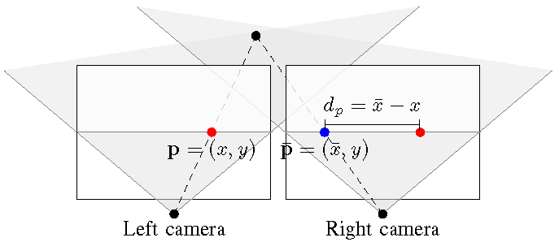

## Real-time Temporal Stereo Matching using Iterative Adaptive Support Weights
Jędrzej Kowalczuk, Eric T. Psota, and Lance C. Pérez
Department of Electrical Engineering, University of Nebraska-Lincoln

[jkowalczuk2,epsota,lperez]@unl.edu

Abstract—Stereo matching algorithms are nearly always designed to find matches between a single pair of images. A method is presented that was specifically designed to operate on sequences of images. This method considers the cost of matching image points in both the spatial and temporal domain. To maintain real-time operation, a temporal cost aggregation method is used to evaluate the likelihood of matches that is invariant with respect to the number of prior images being considered. This method has been implemented on massively parallel GPU hardware, and the implementation ranks as one of the fastest and most accurate real-time stereo matching methods as measured by the Middlebury stereo performance benchmark.

## I.INTRODUCTION
Modern stereo matching algorithms achieve excellent results on static stereo images, as demonstrated by the Middlebury stereo performance benchmark [1], [2]. However, their application to stereo video sequences does not guarantee inter-frame consistency of matches extracted from subsequent stereo frame pairs. The lack of temporal consistency of matches between successive frames introduces spurious artifacts in the resulting disparity maps. The problem of obtaining temporally consistent sequences of disparity maps from video streams is known as the temporal stereo correspondence problem, yet the amount of research efforts oriented towards finding an effective solution to this problem is surprisingly small.

A method is proposed for real-time temporal stereo matching that efficiently propagates matching cost information between consecutive frames of a stereo video sequence. This method is invariant to the number of prior frames being considered, and can be easily incorporated into any local stereo method based on edge-aware filters. The iterative adaptive support matching algorithm presented in [3] serves as a foundation for the proposed method.

## II.BACKGROUND
Stereo matching is the process of identifying correspondences between pixels in stereo images obtained using a pair of synchronized cameras. These correspondences are conveniently represented using the notion of disparity, i.e. the positional offset between two matching pixels. It is assumed that the stereo images are rectified, such that matching pixels are confined within corresponding rows of the images and thus disparities are restricted to the horizontal dimension, as illustrated in Figure 1. For visualization purposes, disparities recovered for every pixel of a reference image are stored together in the form of an image, which is known as the disparity map.

disparity map. Note that individual disparities can be converted to actual depths if the geometry of the camera setup is known, i.e., the stereo configuration of cameras has been pre-calibrated.

_Figure 1: Geometry of two horizontally aligned views where p denotes a pixel in the reference frame, $ \overline{p} $ denotes its matching pixel in the target frame, and $ dp $ denotes the disparity between them along the horizontal dimension._

In their excellent taxonomy paper [1], Scharstein and Szeliski classify stereo algorithms as local or global methods. Global methods, which offer outstanding accuracy, are typically derived from an energy minimization framework that allows for explicit integration of disparity smoothness constraints and thus is capable of regularizing the solution in weakly textured areas. The minimization, however, is often achieved using iterative methods or graph cuts, which do not lend themselves well to parallel implementation.

In contrast, local methods, which are typically built upon the Winner-Takes-All (WTA) framework, have the property of computational regularity and are thus suitable for implementation on parallel graphics hardware. Within the WTA framework, local stereo algorithms consider a range of disparity hypotheses and compute a volume of pixel-wise dissimilarity metrics between the reference image and the matched image at every considered disparity value. Final disparities are chosen from the cost volume by traversing through its values and selecting the disparities associated with minimum matching costs for every pixel of the reference image.

Disparity maps obtained using this simple strategy are often too noisy to be considered usable. To reduce the effects of noise and enforce spatial consistency of matches, local stereo algorithms consider arbitrarily shaped and sized support windows centered at each pixel of the reference image,

