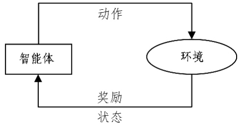
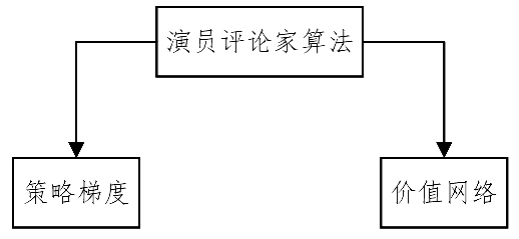

## 多智能体强化学习综述
杜威1 丁世飞1,2

(中国矿业大学计算机科学与技术学院    江苏 徐州 221116)1
(中国科学院计算技术研究所智能信息处理重点实验室    北京 100190)2

摘要多智能体系统是一种分布式计算技术,可用于解决各种领域的问题,包括机器人系统、分布式决策、交通控制和商业管理等。多智能体强化学习是多智能体系统研究领域中的一个重要分支,它将强化学习技术、博弈论等应用到多智能体系统,使得多个智能体能在更高维且动态的真实场景中通过交互和决策完成更错综复杂的任务。文中综述了多智能体强化学习的最新研究进展与发展动态,首先介绍了多智能体强化学习的基础理论背景,回顾了文献中提出的学习目标和经典算法,其被分别应用于完全合作、完全竞争和更一般(不合作也不竞争)的任务。其次,综述了多智能体强化学习的最新进展,近年来随着深度学习技术的成熟,在越来越多的复杂现实场景任务中,研究人员利用深度学习技术来自动学习海量输入数据的抽象特征,并以此来优化强化学习问题中智能体的决策。近期,研究人员结合深度学习等技术,从可扩展性、智能体意图、奖励机制、环境框架等不同方面对算法进行了改进和创新。最后,对多智能体强化学习的应用前景和发展趋势进行了总结与展望。目前多智能体强化学习在机器人系统、人机博弈、自动驾驶等领域取得了不错的进展,未来将被更广泛地应用于资源管理、交通系统、医疗、金融等各个领域。关键词强化学习,多智能体系统,博弈论,多智能体强化学习,深度学习

中图法分类号TP181文献标识码A DOI 10.11896/j.issn.1002-137X.2019.08.001

## Overview on Multi-agent Reinforcement Learning
DU Wei$^{1}$ DING Shi-fei$^{1,2}$ (School of Computer Science and Technology,China University of Mining and Technology,Xuzhou,Jiangsu 221116,China)$^{1}$ (Key Laboratory of Intelligent Information Processing,Institute of Computing Technology,Chinese Academy of Sciences,Beijing 100190,China)$^{2}$

Multi-agent system is a distributed computing technology, which can be used to solve problems in various fields, including robot system, distributed decision-making, traffic control and business management. Multi-agent reinforcement learning is an important branch in the field of multi-agent system research. It applies reinforcement learning technology and game theory to multi-agent systems, enabling multiple agents to complete more complicated tasks through interaction and decision-making in higher-dimensional and dynamic real scenes. This paper reviewed the recent research progress and development of multi-agent reinforcement learning. Firstly, the theoretical background of multi-agent reinforcement learning was introduced, and the learning objectives and classical algorithms of multi-agent reinforcement learning proposed in the literature were reviewed, which are respectively applied to complete cooperation, complete competition and more general (neither cooperation nor competition) tasks. Secondly, the latest development of multi-agent reinforcement learning was summarized. With the maturity of deep learning technology in recent years, in more and more complex realistic scene tasks, researchers use deep learning technology to automatically learn abstract features of massive input data, and then use these data to optimize the decision-making of agents in reinforcement learning. Recently, researchers have combined deep learning and other technologies to improve and innovate algorithms in different aspects, such as scalability, agent intent, incentive mechanism, and environmental framework. At the end of this paper, the prospect of the application of multi-agent reinforcement learning were summarized. Multi-agent reinforcement learning has made good progress in the fields of robot system, man-machine game and autonomous driving, and will be applied in the fields of resource management, transportation system, medical treatment and finance in the future.

Keywords Reinforcement learning, Multi-agent systems, Game theory, Multi-agent reinforcement learning, Deep learning

## 1 引言
多智能体系统(Multi-agent System,MAS)是多个智能体组成的集合,其目标是将大而复杂的系统建设成小而彼此互相通信协调的易于管理的系统。多智能体系统自 20 世纪 70 年代被提出以来,就在智能机器人、交通控制、分布式决策、商业管理、软件开发、虚拟现实等各个领域迅速地得到了应用,目前已经成为一种对复杂系统进行分析与模拟的工具。多智能体系统由分布式人工智能演化而来,其研究目的是解决大规模的、复杂的现实问题。在现实问题中,单智能体的决策能力远远不够。使用一个中心化的智能体解决问题时,会遇到各种资源和条件的限制,导致单个智能体无法应对错综复杂的现实环境;而使用多个智能体相互协作可以解决很多问题$^{[1]}$。强化学习(Reinforcement Learning, RL)是机器学习的一种重要方法,它是一种以环境反馈作为输入目标,用试错方法发现最优行为策略的学习方法。在强化学习的数学基础研究取得了突破性的进展后,对强化学习的研究和应用日益增多$^{[2]}$。目前,强化学习已被广泛应用于手工业制造、机器人控制、优化与调度、仿真模拟、游戏博弈等领域$^{[3]}$。目前,结合多智能体系统和强化学习方法形成的多智能体强化学习正逐渐成为强化学习领域的研究热点之一,并在各个领域得到广泛应用$^{[4-6]}$。

多智能体强化学习(Multi-Agent Reinforcement Learning, MARL)是将强化学习的思想和算法应用到多智能体系统中。20世纪90年代, Littman提出了以马尔可夫决策过程(Markov Decision Process, MDP)为环境框架的MARL,为解决大部分强化学习问题提供了一个简单明确的数学框架,后来研究者们大多在这个模型的基础上进行了更进一步的研究。最近,随着深度学习的成功,人们将深度学习的方法与传统的强化学习算法相结合,形成了许多深度强化学习算法,使单智能体强化学习的研究和应用得到迅速发展。比如,DeepMind公司研制出的围棋博弈系统AlphaGO已经在围棋领域战胜了人类顶级选手,并以较大优势取得了胜利,这极大地震撼了社会各界,$^\text{[8]}$,也促使研究人员在多智能体强化学习领域投入更多的精力。以DeepMind,Open AI公司为代表的企业和众多高校纷纷开发MARL的新算法,并将其实应用到实际生活中,目前主要应用于机器人系统$^\text{[9-10]}$、人机对弈$^\text{[11-13]}$、自动驾驶$^\text{[14]}$、互联网广告$^\text{[15]}$和资源利用$^\text{[16-17]}$等领域

本文第2节简单介绍了多智能体强化学习的基础理论；第3节结合深度强化学习的最新算法，从可扩展性、智能体意图等不同角度对多智能体强化学习的最新研究进展进行了综述；第4节对多智能体强化学习在现实领域中的应用和前景进行了探讨；最后总结全文。

## 2 MARL 的基础理论
## 2.1 单智能体强化学习
根据反馈的不同,机器学习方法可以分为监督学习、非监督学习和强化学习。强化学习的智能体通过不断地与动态环境交互和不断地试错来进行学习。如图1所示,在每一个过程中,智能体感知环境的完整状态并采取行动,然后使环境进

入一个新的状态。之后智能体会收到一个反馈，用于评估这次状态转移。这种反馈相比监督学习中的样本标记，其信息量要少且具有延时性。这是因为在监督学习中，智能体总是被告知采用什么动作是正确的；同时，这种反馈的信息量又比没有标记的无监督学习要多，因为在无监督学习中，智能体需要自己去发现正确的行动，并且得不到关于这次行动的任何明确的反馈${}^{[18-19]}$。

单智能体强化学习的目标是智能体通过与环境的不断交互来学习一个最优的策略,使累计回馈最大。图 1 中,一个完整的强化学习任务有几个重要的组成部分:动作、状态、反馈、环境。强化学习的环境是马尔可夫过程,执行策略及价值函数是决策过程中比较重要的概念,最终强化学习的目标可以转化为求解最优贝尔曼方程。

_图1强化学习的基本框架_

_Fig. $1$ Basic framework of reinforcement learning_

## 2.1.1 马尔可夫决策过程
强化学习的环境是用马尔可夫决策过程描述的。马尔可夫决策过程是一种无记忆的随机过程,它对完全可观测环境进行描述

马尔可夫决策过程是这样一个元组：$\langle S,A,R,P\rangle$，其中，$S$ 表示状态空间，$A$ 表示动作空间，$R$ 表示奖励值，$P$ 表示转移概率，$R$ 与 $P$ 都与具体行为 $A$ 对应，数学表达式如下：

$$P _ { S S ^ { \prime } } ^ { a } = P [ S _ { t + 1 } = S ^ { \prime } | S _ { t } = s , A _ { t } = a ]$$

$$R _ { s } ^ { a } = E \left[ R _ { t + 1 } \mid S _ { t } = s , A _ { t } = a \right]$$

其中, $P_{ss'}^{a}$ 是状态转移概率函数 , $R_{s}^{a}$ 是期望奖励函数 。智能体转移到下一个状态的概率以及得到的奖励与当前状态和在此状态下采取的行为相关 。

## 2.1.2策略
智能体采取的策略是概率的集合或分布,其元素 $\pi(a|s)=P[A_t=a|S_t=s]$ 为对过程中某一状态 $s$ 采取可能行为 $a$ 的概率。$\pi$ 仅与当前的状态有关,与历史信息无关;同时,某一确定的策略是静态的,与时间无关。给定一个 MDP$\,[S, A, R, P]$和一个策略 $\pi$,智能体在 MDP 环境下执行策略 $\pi$ 时的概率函数和奖励函数为:

$$P_{S S^{\prime}}^{\pi}=\sum_{a\in A}\pi(a\mid s)P_{S S^{\prime}}^{a}$$

$${ \boldsymbol { R } } _ { S } ^ { \pi } = \sum _ { a \in { \boldsymbol { A } } } \pi ( {\boldsymbol { a } } \mid { \boldsymbol { s } } ) { \boldsymbol { R } } _ { S } ^ { \boldsymbol { a } }$$

其中, $P_{\mathrm{s}_{\mathrm{s}}^{\mathrm{t}}}$ 是指执行策略 $\pi$ 时,执行某一行为的概率与采取这一行为的状态转移概率的乘积和,代表了执行策略 $\pi$ 时智能体从 $\mathrm{s}$ 转移到 $\mathrm{s}^{\prime}$ 的概率;$R_{\mathrm{S}}^{\tau}$ 指执行策略 $\pi$ 时得到的奖励是所有可能执行行为的概率与采取这一行为得到的奖励的乘积和。

## 2.1.3最优价值函数
MDP下的基于策略$\pi$的状态价值函数$v_{\pi}(s)$表示执行策略$\pi$时个体在状态$s$的价值大小,其数学表达式为:

$$v_{\pi}(s)=E_{\pi}\left[G_{t}\mid S_{t}=s\right]$$

最优状态价值函数定义为:$V^\pi(s)=\operatorname*{sup}_aQ^\pi(s,a)$

$$v_* = \max v_\pi(s)$$

MDP 下的行为价值函数 $q_{\pi}(s,a)$ 被用于衡量在当前策略 $\pi$ 下对当前状态 $s$ 执行行为 $a$ 的最优价值。其数学表达式为:

$$q_{\pi}(s,a)=E_\pi[G_t|S_t=s,A_t=a]$$

最优行为价值函数定义为:

$q_{*}(s,a)=\max q_{\pi}(s,a)$

## 2.1.4 最优贝尔曼方程
智能体通过最大化最优价值函数，将得到以下两个方程 $V_\text{opt}^{(k)} = r^{\text{opt}(k)} + \gamma \sum_{j=1}^{n} p(j) V_\text{opt}^{(k)} $ 其也被称为贝尔曼方程。

$$v_{\pi}(s)=E_{\pi}\left[R_{t+1}+\gamma V_{\pi}(S_{t+1}\mid S_{t}=s\right]$$

$$Q_{\pi}(s,a)=E_{\pi}[R_{t+1}+\gamma Q_{\pi}(S_{t+1},A_{t+1})\mid S_{t}=s,A_{t}=a]$$

其中，$\gamma$是折扣因子，用于保证越后面的回报对回报函数的影响越小，刻画了未来回报的不确定性，同时也使得回报函数是有界的。通过式(9)、式(10)可以看出，贝尔曼方程由两部分组成:1)该状态的即时奖励期望;2)下一时刻状态的价值期望乘上衰减系数。贝尔曼方程是对于某一个给定策略，求其状态价值函数和行为价值函数，也即对某一策略进行评估，而强化学习最终的目标是寻找最优策略，于是引入最优贝尔曼方程:

$$V_{\pi}(s) = \max R_{s}^{a} + \gamma \sum_{s' \in S} P_{\mathrm{SS}'}^{a} v_{*}(s')$$

$$Q_{\ast}(s,a)=R_{s}^{a}+\gamma\sum_{s^{\prime}\,\in\,S}P_{ss^{\prime}}^{a}\operatorname*{max}q_{\ast}(s^{\prime},a^{\prime})$$

强化学习的问题最终可以转化为求解最优贝尔曼方程。由于方程是非线性的,因此需要通过一些方法来求解。由此产生了两个重要分类,所有强化学习问题的解决方法基本都可以归结为基于价值的和基于策略的,其中基于价值函数的代表方法是 $Q\text{-learning}^{[20]}$ 。 $Q\text{-learning}$ 最早由 Watkins 和 Dayan 于 1992 年提出,它的价值函数的迭代方式为:

$$Q ( s , a ) \leftarrow ( 1 - \alpha ) Q ( s , a ) + \alpha [ r + \gamma \operatorname* { m a x } Q ( s ^ { \prime } , a ^ { \prime } ) ]$$
其中, $\alpha$ 是学习速率。

## 2.2 多智能体强化学习
多智能体系统由分布式人工智能演变而来,具有自主性、分布性、协调性等特点,并具备学习能力、推理能力和自组织能力。尽管智能体的概念在20世纪40年代就已经出现,但在20世纪70年代之前将多个智能体作为一个整体系统的研究却很少。直到20世纪80年代后期,分布式人工智能开始显著发展,建立在博弈论概念之上的分布式人工智能逐渐演变并最终形成了多智能体系统。之后,在多智能体系统的分布式问题求解模型中,分布式约束推理(DCR)模型(如分布式约束满足问题(DCSP)和分布式约束优化问题(DCOP))的研究和使用较为广泛。DCR在各种分布式问题上都有应用,比如分布式传感器任务分配和分布式会议安排策略等。

最近,大量的研究关注于寻找解决多智能体系统不确定性问题的方法。在各种模型和求解方法中,分布式马尔可夫决策过程(Dec-MDP)和分布式部分可观测马尔可夫决策过程(Dec-POMDP)是不确定性情形下最常用的两种模型。不幸的是,求解Dec-POMDP通常是很难的。强化学习的发展给多智能体系统解决不确定性等问题提供了一种全新的思路,多智能体强化学习正逐渐成为MAS众多子领域中最受

关注的领域。下面对多智能体强化学习的基本概念和经典算法进行了简单的介绍。

首先，MARL 的环境是以马尔可夫决策过程为基础的随机博弈框架，它是这样一个元组$\langle S, A_{1},\cdots ,A_{n},R_{1},\cdots ,R_{n}, P\rangle 。$其中，$n$指多智能体的数量；$A$是所有智能体的联合动作空间集，$A= A_{1}\times\cdots\times A_{n}$；$R_{i}$是每个智能体的奖励函数，$R_{i}: S\times A\times S\rightarrow R$；$P$是状态转移函数，$P: S\times A\times S\rightarrow[0,1]$。我们假设奖励函数是有界的。

在多智能体情况下，状态转换是所有智能体共同行动的结果，因此智能体的奖励也取决于联合策略。定义策略 $H$ 是智能体的联合策略 $H_{i}: S \times A \to H$，相应地，每个智能体的奖励为：

$${ R } _ { i } ^ { H } = \operatorname* { E } [ R _ { t + 1 } \mid S _ { t } = s , A _ { t , i } = a , H ]$$

其贝尔曼方程为:

$$\upsilon _ { i } ^ { H } ( s ) = E _ { i } ^ { H } \left[ R _ { t + 1 } + \gamma V _ { i } ^ { H } ( S _ { t + 1 } ) \mid S _ { t } = s \right]$$

$$Q _ { i } ^ { H } ( s , a ) = E _ { i } ^ { H } [ R _ { t + 1 } + \gamma Q _ { i } ^ { H } ( S _ { t + 1 } , A _ { t + 1 } ) | S _ { t } = s , A _ { t } = a ]$$

根据任务类型，多智能体强化学习可以分为完全合作、完全竞争和混合型。在完全合作的随机博弈中，奖励函数对于所有智能体都是相同的，即 $R_{1} = R_{2} = \cdots = R_{n}$，因此回报也相同，多智能体的目标就是最大化共同回报。如果 $n=2, R_{1 = - R_{2}}$，那么两个智能体有相反的目标，随机博弈就是完全竞争的。此外，存在既不完全竞争也不完全合作的策略，称其为混合策略。

在完全合作的随机博弈中，回报可以共同最大化。在其他情况下，智能体的回报通常是不同且相关的，它们不可能独立最大化。因此，指定良好的、通用的 MARL 目标是一个难题。回顾已有文献中对学习目标的定义，其主要可以概括为两个方面:稳定性和适应性。

稳定性指智能体的学习动力的稳定性以及策略会收敛至固定。适应性确保智能体的表现不会因为其他智能体改变策略而下降。收敛至均衡态是稳定性的基本要求,即所有智能体的策略收敛至协调平衡状态,最常用的是纳什均衡。适应性体现在理性或无悔两个准则上。理性是指当其他智能体稳定时,智能体会收敛于最优反馈;无悔是指最终收敛的策略的回报不能差于任何其他策略的回报。在确定学习目标以后，我们根据不同的任务类型对经典的强化学习算法做了分类和回顾。

## 2.2.1 完全合作
在完全合作的随机博弈中, 锁蠢本樍flo相同的奖励函数元W諑剔سياساتpb时学习目标可以外经历sed表ませ为:

$$Q _ { t + 1 } ( s _ { t } , a _ { t } ) = Q _ { t } ( s _ { t } , a _ { t } ) + \alpha \big [ r _ { t + 1 } + \gamma \max Q _ { t + 1 } ( s _ { t + 1 } , a ^ { \prime } ) -$$

$$\mathbf{Q}_{t} \left(s_{t}, a_{t}\right)$$

与单智能体一样，智能体会采用贪婪策略来最大化回报：

$$h_{i}(x)=\arg\max_{a_{i}}\max_{a_{i}\cdots a_{n}}Q^{*}(s,a)$$

然而,各智能体在做决策时是非独立的,即使它们平行地学习一个共同的目标,因此考虑智能体之间的协作问题变得很有必要。Team-Q算法$^{\text{[21]}}$通过假设最优的联合行动是唯一的来避免协作问题。Distributed-Q算法$^{\text{[22]}}$在不假设协调的

情况下以有限的计算量解决协作任务,其计算复杂度与单智能体\(Q\)学习的计算复杂度相似。然而,该算法只适用于具有非负报酬函数的确定性问题。上述算法存在一些局限,即它们都依赖于对状态的精确测量,一些还需要精确测量其他智能体的作用,并且还会受维数灾难的影响。

## 2.2.2　完全竞争
在完全竞争的随机博弈中(对于两个智能体，即 $R_{1}=R_{2}$ ，可以应用极小极大化原则)：在最坏情况下假设最大化一个智能体的回报，这个假设是对手将始终努力使其回报最小化。minimax-Q 算法采用极小极大原理来计算阶段游戏的策略和值，以及类似于 Q 学习的时序差分规则。下面给出智能体 1 的算法：

$$h _ { 1 , t } ( s _ { t } , \cdot ) = \arg \, m _ { 1 } ( Q _ { t } , x _ { t } )$$

$$Q_{t+1}(s_{t},a_{1,t},a_{2,t})=Q_{t}(s_{t},a_{1,t},a_{2,t})+\alpha[r_{k+1}+\gamma m_{1}(Q_{t})]$$

$$a_{t+1)} - Q_t(s_t, a_{1,t}, a_{2,t})$$

其中,$m_1$是智能体$1$的极小极大化回报。

$$m_{1}(Q,s)=\operatorname*{max}_{h_{1(.,.)}}\operatorname*{min}_{a_{2}}\sum_{a_{1}Q(s,a_{1},a_{2})}h_{1}(x,a_{1})Q(s,a_{1},a_{2})$$

其中,在状态$s$时的智能体$1$的随机策略由$h_{1(s,.)}$表示,点代表动作参数。最优化问题可以由线性规划解决。

## 2.2.3  混合型任务
在混合随机博弈中,智能体的奖励函数不受约束,这种模式最适合自私的智能体。博弈论均衡概念在混合随机博弈中运用得最多,该类别中的大量算法仅针对静态任务。像 Q 学习这样的单智能体算法可以直接应用到混合型任务中。参数的更新需要使用所有智能体的 Q 表,因此每个智能体都要复制其他智能体的 Q 表,这要求所有的智能体使用相同的算法并且可以测量所有的动作和奖励。即使有了这些假设,当不同智能体求得的策略不唯一时,也会出现均衡选择问题。一种常用的方法是 Nash Q-learning,此外还有相关平衡 Q 学习 (CE-Q [23]) 或不对称 Q 学习 (Asymmetric Q-learning [24]),它们可以分别通过使用相关或 Stackelberg(前导-跟随) 平衡来解决均衡问题。对于不对称 Q 学习,跟随者不需要对领导者的 Q 表进行建模,但是领导者必须知道追随者如何选择其行动。

表1简单地对各种算法进行了对比和总结。

_表$1$基于博弈的经典MARL算法的对比_

_Table 1 Comparison of classic MARL algorithm based on game theory_

| 算法                           | 值函数更新                                                                                                                                                                         | 动作选择                                                                          |
|------------------------------|----------------------------------------------------------------------------------------------------------------------------------------------------------------------------------|----------------------------------------------------------------------------------|
| Q-learning                    | $\displaystyle Q(s, a) \leftarrow (1 - \alpha) Q(s, a) + \alpha [r + \gamma \max_{a'} Q(s', a')]$                                                                                  | $\varepsilon$-贪心策略, 或基于玻尔兹曼机分布的动作选择                                     |
| Minimax Q                     | $\displaystyle Q(s, a, o) \leftarrow (1 - \alpha) Q(s, a, o) + \alpha [r + \gamma V(s')]$                                                                                       | 根据当前学习到的策略 $\pi$ 选择动作 fatigue sounded like someone for the asian                       |
| Nash Q                        | $\displaystyle V(s') = \max_{\pi} \min_{o} \sum_{a} Q(s', a, o) \pi(s', a')$                                                                                                     | 根据当前博弈的纳什均衡选择动作 math $$\pi$$ consists of defeating a China flood seems                       |
| CE-$Q$                        | $\displaystyle Q(s, a) \leftarrow (1 - \alpha) Q(s, a) + \alpha [r_{i} + \gamma \operatorname{CEQ}_{i}(s')]$                                                                     | 根据当前博弈的相关均衡选择动作 math $$\pi$$ consists of defeated a China flood seems                   |

_注:o 代表相互博弈的智能体的对手采取的动作_

然而, 传统的 MARL 算法多适用于小规模的问题, 很少有算法能应用于信息不完整或不确定的环境。提高 MARL 对实际问题的适应性是一个必不可少的研究步骤25.

## 3 MARL的研究进展
经典的 MARL 算法通常仅适用于小问题,如静态游戏和小网格世界,而在现实的多智能体问题中,状态和动作空间很大甚至是连续的。很少有传统算法能够适用于不完整的、不确定的环境。可扩展性和处理不完全信息环境也是之前单智能体强化学习中未解决的问题。然而,随着深度学习的发展,单智能体的可扩展性等问题在一定程度上得到了解决。借助深度学习快速发展的红利,研究人员结合深度学习等技术,从可扩展性、智能体意图、奖励机制、环境框架等诸多方面对多智能体算法进行了改进和创新。

## 3.1 深度强化学习的主要进展
## 3.1.1深度Q网络
深度 Q 网络 (Deep Q-Network, DQN) 是由 Mnih 等 $^{[26]}$ 提出的。它依托强化学习中经典的 Q 学习, 用一个深度网络近似价值函数为深度网络提供目标值, 不断更新网络直至收敛。其中涉及 3 项关键技术: 1) 用经验重放技术打破了样本间的关联性, 将采集到的样本先放入样本池, 然后从池中随机选出一个样本用于网络训练; 2) 设置了目标网络来单独处理时间差分算法中的 TD 偏差, 使训练的稳定性和收敛性得到极大的提高; 3) 利用卷积神经网络逼近行为值函数。其他学者也

围绕 DQN 做了许多研究和改进。Hasselt 等\textsuperscript{[27]} 提出了双 DQN 算法, 使得值估计过于乐观这一问题得到解决。Schaul 等\textsuperscript{[28]} 使用了经验优先 回放技术，对经验的优先次序进行处理。此外 Osband 等\textsuperscript{[29]} Munos 等\textsuperscript{[30]} Francois-lavet 等也分别从其他角度对 DQN 提出了改进。

## 3.1.2 演员评论家算法
演员评论家算法（Actor-Critic, AC）的架构可以追溯到 30~40 年前（见图 2）。最早，Witten 于 1977 年提出了类似 AC 算法的方法；然后，Barto, Sutton 和 Anderson 等于 1983 年引入了 AC 架构。但是，AC 算法的研究难度和一些历史偶然因素使得之后学术界开始将研究重点转向基于价值的方法。之后的一段时间里，基于价值的方法和基于策略的方法都有了蓬勃的发展。AC 算法结合了两者的发展红利，在理论和实践方面再次有了长足的发展。

_图2演员评论家算法的基本框架_

_Fig. 2 Basic framework of actor-critic algorithm_

该结构包含两个网络 ：一个策略网络 (Actor) 和一个价值网络 (Critic) 。策略网络输出动作 ，价值网络评判动作 。策略网络通过梯度计算公式进行更新 ，而价值网络根据目标值进行更新 。相比以值函数为中心的算法 ，AC 算法应用了策略

梯度的方法,这使得它能在连续动作或更高维动作空间中选取合适的动作；而 ${\mathrm{Q}}$ 学习难以实现这个目标,甚至会瘫痪。相比单纯策略梯度,AC 算法应用了 ${\mathrm{Q}}$ 学习或其他策略评估方法,使得 AC 算法能进行单步更新而不是回合更新,比单纯的策略梯度的效率更高。

## 3.1.3深度确定性策略梯度
深度Q网络是一种基于价值函数的方法，难以应对大的连续动作空间，无法输出离散状态动作值。Lillicrap等[32]于2015年提出的深度确定性策略梯度(Deep Deterministic Policy Gradients, DDPG)是基于上述AC算法的，结合确定性策略梯度算法(Deterministic Policy Gradients, DPG)，在动作输出方面采用一个网络来拟合策略函数，直接输出动作，可以应对连续动作的输出以及更大的动作空间。此外，AC模型还衍生出很多种算法，如异步优势行动评论家算法(A3C)[33]和分布式近似策略优化算法(DPPO)[34-35]。A3C算法由Mnih于2016年提出，在DQN中为了破坏训练样本之间的相关性，采用了经验重放技术，即把训练样本缓存起来，每次训练时从中随机抽取一个minibatch。在A3C中，利用多线程并行地去采集数据，每个线程以一个独立的智能体形式去搜索独立环境；同时，每个智能体还可以平行地利用不同的探索策略进行采样，这样每个线程得到的样本天然不相关，而且采样速度也更快。

## 3.2 MARL 算法进展
## 3.2.1 可扩展性
可扩展性是目前MARL领域的核心关注点。早期的多智能体强化学习研究都是应用于小问题，在离散的动作和状态空间上对Q学习算法进行改进和完善。但是将算法扩展到现实的多智能体问题时，其中状态和动作空间是很大甚至连续的，Q函数的表格存储变得不切实际或不可能。受强化学习与深度学习技术相结合的启发，研究人员把DQN和DPG等技术应用到多智能体强化学习中。近期的大部分研究集中于此。

将DQN泛化到MARL存在的最大问题是经验重放的方法变得不再适用,如果不知道其他智能体的状态,那么不同情况下自身的状态转移概率会不同。Foerster等[36]提出了两种方法对经验重放方法进行改进,使多智能体在使用经验重放技术时更稳定并更具兼容性。一方面使用一个运用重要性抽样的多智能体变量来自然衰减过时数据,将经验重放的数据解释为环境外数据[37]。由于较旧的数据往往会产生较低的重要性,因此这种方法能避免非固定重放经验数据产生的混淆。另一方面,让每个智能体通过观察其他智能体的决策来推测其他智能体的行为,这一方法能适用于更大范围的深度网络。其算法在传统多智能体算法IQL[38−41]上做了改进,IQL算法的全称是independentQ-learning,顾名思义,其是对每个智能体独立地执行一次Q-learning算法,将其他智能体视为环境的一部分。IQL的点在于它忽略了这样一个事实:这些智能体的策略会随着时间的推移而变化,使其自身的Q函数变得非平稳。而研究人员通过让每个智能体推断其他智能体的行为并学习一种策略来规避其他智能体的策略,从而改善了IQL的非平稳性。

Yang等$^{[42]}$提出了平均场强化学习对多智能体系统中的动态行为进行建模,有效地回应了相邻智能体的平均效应,通过将多智能体问题简化为两个智能体的问题,解决了智能体数量增加导致的维数和指数增加的问题。他们没有分别考虑单个智能体对其他个体产生的不同影响,只是将领域内所有其他个体的影响用一个均值来代替,这样,对于每个个体,只需要考虑个体与这个均值的交互作用即可。应用平均场论后,学习在两个智能体之间是相互促进的:单个智能体的最优策略的学习是基于智能体群体动态的;同时,集体的动态也根据个体的策略进行更新。

还有研究人员对DQN在多智能体上的应用做了很多工作。Tuyls等[43]提出了LDQN算法，将宽容政策引入深度Q网络，采用宽大处理方法更新消极政策，使收敛性和稳定性都得到提高。Zheng等[44]提出了一个多智能体深度强化学习框架，称其为加权双深Q网络(WDDQN)。通过利用深度神经网络和加权双估计器，WDDQN不仅可以有效减小偏差，而且可以扩展到许多深度强化学习场景。根据经验，WDDQN在随机合作环境中的性能和收敛效果优于现有的DRL算法(双DQN)和MARL算法(宽松Q学习)。Tampuu等[45]证明了由自主深度Q网络控制的智能体能够从原始感官数据中学习双人视频游戏。

将 DPG 应用到更高维的多智能体环境中时面临的最大问题是,环境的不断变化进一步增大了学习的方差。Song 等 [46] 提出了一种新的多智能体策略梯度算法,该算法解决了通常观测到的高方差梯度估计问题,在粒子高复杂环境中可以有效优化多机器人协作控制任务。Wai 等 [47] 为了使基于策略的 MARL 更具可扩展性和鲁棒性,提出了一种分散的局部交换方案,其中每个智能体只通过网络与邻居通信。这是一种双重平均方案,其中每个智能体分别在空间和时间上迭代,以分别合并相邻梯度信息和本地奖励信息。Abouheaf 等 [48] 针对基于图交互的多智能体系统,提出了一种基于策略迭代的在线自适应强化学习方法。该方法利用降值函数求解多智能体系统的耦合贝尔曼方程,在用策略迭代方法进行更新时,考虑了降值函数以降低计算复杂度,解决了大规模优化问题。

还有一些学者开始将基于AC框架的算法应用到多智能体强化学习中。Open AI提出的MADDPG算法,实质上是DDPG算法的一种延伸和扩展。MADDPG的基本架构与DDPG一样，每一个智能体使用自己独立的表演者，通过自己观察状态输出，确定动作, 同时训练数据也只能使用自己产生的训练数据。每个智能体同时也对应一个评论家, 不同的是这个评论家将同时接受所有表演者的数据, 这种中心化的评论家存在多个。该算法基本解决了DQN经验重放不再适用和DPG方差过大的问题。这种以AC为架构的算法与多智能体强化学习的结合是未来研究的一个重要方向。

## 3.2.2 智能体意图
人类物种的成功归功于人们对物质世界和社会环境的显著适应性。人类社会智能赋予我们推理其他人心态的能力，这种心理状态推理广泛影响着我们日常生活中的决策。例如,安全驾驶要求我们推断其他驾驶员的意图并做出相应的决定。这种微妙的意图决策(心智理论) 行为在人类活动中无

处不在,但即使在最先进的多智能体系统中也很难实现。

于是人们尝试了很多关于智能体自主意图的研究工作$^{[49]}$Qi等提出了一种意图感知的多智能体规划框架以及学习算法，在此框架下，智能体计划在目标空间中最大化预期效用，并且在规划过程中考虑了其他智能体的意图；他们提出了一个简单但有效的效用函数的近似函数，而不是将学习问题公式化为部分可观察的马尔可夫决策过程。Raileanu等$^{[50]}$提出了一种新的学习方法SOM(Self Other-Modeling)，其中智能体使用自己的策略来预测另一个智能体的策略，并在线更新其隐藏的状态。Rabinowitz等$^{[51]}$提出了一种心智理论的神经网络(Theory of Mind neural network，ToMnet)，该网络使用元学习，通过观察其行为来构建智能体所遇到的模型。研究者将ToMnet应用到简单的格子环境中的智能体上，研究结果表明它可以学习和模拟来自不同群体的行为，并且它通过了经典的ToM任务测试。可以通过训练ToMnet来预测其他智能体的意图，并且其明确地揭示了其他智能体的错误意图．

## 3.2.3 奖励机制
多智能体系统中的奖励机制比单智能体中的奖励机制更加复杂。目前,在MARL中应用的一些奖励信号存在问题。比如，全局奖励信号向所有智能体分配相同的奖励而不区分它们的贡献,这可能会鼓励懒惰的智能体;而本地奖励信号仅基于个体行为向每个智能体提供不同的本地奖励,这又可能会产生自私的智能体。如何设计一个合适的奖励信号来加速学习和稳定收敛,是一个关键问题。有研究人员设计了一些混合的奖励信号,智能体通过混合信号能学习到更好的策略,实验结果也得到提高。除了混合信号外，Omidshafiei等研究证明在智能体之间添加通信机制能显著提高团队的最终绩效，他们第一次在多智能体强化学习中引入了教学机制。其主要贡献是将元学习的思想引入合作的多智能体强化学习中,将智能体的学习进度作为奖励反馈机制。

## 4M ARL 的应用和前景
近几年,MARL在许多领域都得到了实际应用,目前在机器人系统、人机博弈和自动驾驶等领域开展的研究较多。在机器人系统领域,Gu等[53]提出了一种基于离线策略的深度强化学习算法,其可以有效地训练真实的物理机器人。机器人可以在没有任何演示或手动设计的情况下,学习各种仿真与复杂的操作技巧。Foerster等[10]将多智能体强化学习方法应用到机器人交流领域,他们采用集中学习分散执行的方式,第一次实现了机器人之间的深层次交流。Duan等[54]在机器人控制上的实践工作对多智能体强化学习的应用也具有启发意义。人机博弈一直都是人工智能领域最具挑战性也最令人兴奋的工作,2018年Open AI和DeepMind相继取得重大进展。Open AI在实时5v5策略游戏dota2中战胜人类顶级玩家;DeepMind在复杂的第一人称多人游戏QuakeIII中达到人类水平,还能与人类玩家合作[11-13]。在自动驾驶领域,Shalev-Shwartz等[14]针对自动驾驶的安全性和环境的不可预测性问题进行了改进和优化,并展示了如何在没有MDP假设的情况下使用策略梯度迭代,以及用随机梯度上升来最小化梯度估计的方差。

可以预见的是,未来MARL还将被更广泛地应用到各行各业,如互联网、资源管理、交通系统、医疗和金融等领域。目前,在互联网领域,Ji等[15]将聚类的思想与MARL方法相结合,面对大量的广告商,对即时在线投标的性能进行了优化;为了平衡广告商之间的竞争与合作,提出并实现了一种实用的分布式协调多智能体竞标算法。在资源管理方面,Xi等[16]提出了一种MARL新算法,新算法不基于马尔可夫假设,具有更快的收敛速度和更强的鲁棒性,使得电网系统能够在更复杂的条件下提高新能源的利用率。Perolat等[17]运用部分马尔可夫观测模型对公共资源的占用主体进行了建模,揭示了排他性、可持续性和不平等性之间的关系,并提出了解决方案,提高了资源管理能力。Kofinas等[55]提出的模糊Q学习方法有效地提高了分散式微电网的能量管理能力。在交通控制领域,Chen等[56]提出了一种基于MARL的协同控制框架,并用其来实时缓解公交车道上的公交拥挤,Vidhate等[57]提出了一种基于协同多智能体强化学习的交通流模型用于控制优化交通系统,模型能够很好地处理未知的复杂状态。目前,多智能体温么热性炭法用人单位在医疗和金融等领域的研究还较少,需要人们进行更进一步的探索。

MARL虽然已经在诸多领域中实现了应用,但依然存在很多问题。在MARL未来的研究工作和实际应用中,有一些方向需要进行进一步的关注和探索。首先,可扩展性依然是最核心的问题。目前,MARL在电脑游戏、人机博弈(包括小型机器人体系)中已经取得了不错的成果,其中DeepMind公司和OpenAI公司做出了重要的贡献。但是,MARL在自动驾驶、船舶制造、商业交易、资源配置等大型机器人体系中的应用还不够成熟,因此将MARL应用到海量智能体以及更复杂的环境中是未来研究的重要方向。其次,现在普遍的多智能体强化学习都是基于马尔可夫随机过程环境的,它给许多模型提供了一个简单明确的数学框架,但是现实环境中很多场景和问题是非马尔可夫的,在大部分多智能体场景中,其他智能体的行为是不可预测的。上文提到的Shalev等$\stackrel[14]{\ }$和Xi等$\stackrel[16]{\ }$提出的MARL新算法都不基于马尔可夫假设。因此,在没有马尔可夫假设的情况下建模实现MARL,需要进行进一步的研究与探索。最后,无监督的生成模型、计算图模型、注意力机制等其他机器学习方法与MARL的结合可以解决许多实际应用的问题。迁移学习也将被更多地应用到MARL方法中,以缓解真实任务场景中训练数据缺乏的问题。借助云服务器端的分布式的多智能体协同学习也是未来一个重要的方向。

结束语 根据本文，马尔可夫强化学习研究了多智能体强化学习，包括 MARL 的基础背景、经典算法、研究进展以及实际应用。在许多现实问题和领域中，多智能体强化学习都展现出了巨大的潜力，研究成果层出不穷，各种算法不断涌现。本文首先介绍了多智能体强化学习的理论背景和经典算法，包括马尔可夫框架和随机博弈模型等；然后主要从算法的可扩展性方面详细综述了近期多智能体强化学习算法的创新和改进交互; 最后对多智能体强化学习的实际应用和未来前景展开讨论。多智能体强化学习是一个新兴的、活跃的、快速扩展的研究领域，还有很多问题值得进一步探索和研究。随着 MARL 理论和方法研究的不断深入，可以预见，“解决智能，并用智能解决
一切”这一目标终将被实现。

## 参考文献
[1] ZHAO Z H, GAO Y, LUO B, et al. Reinforcement Learning Technology in Multi-Agent System [J]. Computer Science, 2004, 31(3): 23-27. (in Chinese) 赵志宏,高阳,骆斌,等. 多 Agent 系统中强化学习的研究现状和发展趋势[J]. 计算机科学,2004,31(3):23-27.
[2] GAO Y, CHEN S F, LU X. Research on Reinforcement Learning Technology: A Review[J]. ACTA AUTOMATICA SINICA, 2004, 30(1): 86-100. (in Chinese) 高阳,陈世福,陆鑫. 强化学习研究综述[J]. 自动化学报,2004, 30(1):86-100.
[3] LIU Q, ZHAI J W, ZHANG Z C, et al. A Survey on Deep Reinforcement Learning [J]. Chinese Journal of Computers, 2018, 40(1): 1-27. (in Chinese) 刘全,翟建伟,章宗长, 等. 深度强化学习综述[J]. 计算机学报,2018,40(1):1-27.
[4] YANG W C, ZHANG L. Multi-agent reinforcement learning based traffic signal control for integrated urban network: survey of state of art[J]. Application Research of Computers, 2018, 35(6): 13-18. (in Chinese) 杨文臣,张轮. 多智能体强化学习在城市交通网络信号控制方法中的应用综述[J]. 计算机应用研究,2018,35(6):13-18.
[5] ZHANG W X, MA L, WANG X D. Reinforcement learning for event-triggered multi-agent systems [J]. CAAI Transactions on Intelligent Systems, 2017, 12(1): 82-87. (in Chinese)

张文旭,马磊,王晓东. 基于事件驱动的多智能体强化学习研究[J]. 智能系统学报,2017,12(1):82-87.
[6] XI L, CHEN J F, HUANG Y H, et al. Smart generation control based on multi-agent reinforcement learning with the idea of the time tunnel[J]. Scientia Sinica, 2018, 48(4): 441-456. (in Chinese)

席磊, 陈建峰, 黄悦华, 等. 基于具有时间隧道思想的多智能体强化学习的智能发电控制方法[J]. 中国科学: 技术科学, 2018, 48(4): 441-456.

[7]LITTMAN M L. Markov games as a framework for multi-agent reinforcement learning[M]. New Brunswick: Machine Learning Proceedings, 1994:157-163.

[8] ZHAO X Y,DING S F. Research on Deep Reinforcement Learning[J]. Computer Science,2018,45(7):1-6. (in Chinese)

[9] GU S, HOLLY E, LILLICRAP T, et al. Deep reinforcement learning for robotic manipulation with asynchronous off-policy updates [C] // IEEE International Conference on Robotics and Automation. Singapore: IEEE Press, 2017: 3389-3396.

[10] FOERSTER J , ASSAEL I , DE FREITAS N , et al. Learning to communicate with deep multi-agent reinforcement learning [C] // Advances in Neural Information Processing Systems . Spain : NIPS Press , 2016 : 2137-2145 .

[12] LANCTOT M, ZAMBALDI V, GRUSLATS A, et al. A unified game-theoretic approach to multi-agent reinforcement learning [C]// Advances in Neural Information Processing Systems. Los Angeles: NIPS Press, 2017: 4190-4203.
[13] LEIBO J, ZAMBALDI V, LANCTOT M, et al. Multi-agent reinforcement learning in sequential social dilemmas [C]// Proceedings of the 16th Conference on Autonomous Agents and Multi-agent Systems. Singapore: AAMAS Press, 2017: 464-473.
[14] SHALEV-SHWARTZ S, SHAMMAH S, SHASHUA A. Safe, multi-agent, reinforcement learning for autonomous driving [J/OL]. https://arxiv.org/abs/1610.03295.
[15] JIN J, SONG C, LI H, et al. Real-Time Bidding with Multi-Agent Reinforcement Learning in Display Advertising [J/OL]. https://arxiv.org/abs/1802.09756.
[16] XI L, CHEN J, HUANG Y, et al. Smart generation control based on multi-agent reinforcement learning with the idea of the time tunnel [J]. Energy, 2018, 153: 977-987.
[17] PEROLAT J, LEIBO J Z, ZAMBALDI V, et al. A multi-agent reinforcement learning model of common-pool resource appropriation [C]// Advances in Neural Information Processing Systems. Los Angeles: NIPS Press, 2017: 3643-3652.
[18] SUTTON R. Introduction: The challenge of reinforcement learning [M]. Springer, Boston, MA: Reinforcement Learning, 1992: 1-3.
[19] BUSONIU L, BABUŠKA R, DE SCHUTTER B. Multi-agent reinforcement learning: An overview [J]. Innovations in multi-agent systems and applications-1, 2010, 310: 183-221.
[20] WATKINS C, DAYAN P. Q-learning [J]. Machine Learning, 1992, 8(3/4): 279-292.
[21] LITTMAN M. Value-function reinforcement learning in Markov games [J]. Cognitive Systems Research, 2001, 2(1): 55-66.
[22] LAUER M, RIEDMILLER M. An Algorithm for Distributed Reinforcement Learning in Cooperative Multi-Agent Systems [C]// Seventeenth International Conference on Machine Learning. Stanford: Morgan Kaufmann Press, 2000: 535-542.
[23] GREENWALD A, HALL K, SERRANO R. Correlated Q-learning [C]// ICML. Washington: ICML Press, 2003: 242-249.
[24] KONONEN V. Asymmetric multiagent reinforcement learning [C]// International Conference on Intelligent Agent Technology. Canada: IEEE Press, 2003: 336-342.
[25] HU J, WELLMAN M. Multiagent reinforcement learning: theoretical framework and an algorithm [C]// ICML. Wisconsin: ICML Press, 1998: 242-250.
[26] MNIH V, KAVUKCUOGLU K, SILVER D, et al. Playing Atari with Deep Reinforcement Learning [C]// Proceedings of Workshops at the 26th Neural Information Processing Systems 2013. Lake Tahoe, USA: NIPS Press, 2013: 201-220.
[27] VAN HASSELT H, GUEZ A, SILVER D. Deep Reinforcement Learning with Double Q-Learning [C]// AAAI. Arizona: AAAI Press, 2016: 5.
[28] SCHAUL T, QUAN J, ANTONOGLOU I, et al. Prioritized experience replay [C]// proceedings of the 4th International Conference on Learning Representations. San Juan, Puerto Rico: ICLR Press, 2016: 322-355.

[29] OSBAND I, VAN ROY B, WEN Z. Generalization and exploration via randomized value functions[J]. Proceedings of the 33rd International Conference on International Conference on Machine Learning, 2014, 48(1): 2377-2386.
[30] MUNOS R, STEPLETON T, HARUTYUNYAN A, et al. Safe and efficient off-policy reinforcement learning[C] // Advances in Neural Information Processing Systems. Spain: NIPS Press, 2016: 1054-1062.
[31] FRANÇOIS-LAVET V, FONTENEAU R, ERNST D. How to discount deep reinforcement learning: Towards new dynamic strategies[C] // Proceedings of the Workshops at the Advances in Neural Information Processing Systems. Montreal, Canada: NIPS Press, 2015: 1107-1160.
[32] LILlicRAT T P, HUN T J J, PRITZEL A, et al. Continuous control with deep reinforcement learning: U. S. Patent Application 15/217, 758[P]. 2017-1-26.
[33] MNih V, BADIA A P, MIRZA M, et al. Asynchronous methods for deep reinforcement learning[C] // International Conference on Machine Learning. New York City: ICML press, 2016: 1928-1937.
[34] SCHULMAN J, WOLSKI F, DHARIWAL P, et al. Proximal policy optimization algorithms[J/OL]. https://arxiv.org/abs/1707.06347.
[35] HEEEE S N, SRIRAM S, LEMMON J, et al. Emergence of locomotion behaviors in rich environments[J/OL]. https://arxiv.org/abs/1707.02286.
[36] FOERSTER J, NARDELLI N, FaRQUOHAR G, et al. Stabilizing experience replay for deep multi-agent reinforcement learning[J]. International Conference on Machine Learning, 2017, 70(3): 1146-1155.
[37] CIOSEK K, WHITESON S. Offer: Off environment reinforcement learning[J]. AAAI Conference on Artificial Intelligence, 2017.
[38] TESAURO G. Extending q-learning to general adaptive multi-agent systems[J]. Advances in Neural Information Processing Systems, 2004, 16(4): 871-878.
[39] TAN M. Multi-Agent Reinforcement Learning: Independent vs. Cooperative Agents[C] // Proceedings of the Tenth International Conference on Machine Learning. MA, USA: ICML Press, 1993: 330-337.
[40] SHOHAM Y, LEYTON-K. Multiagent Systems: Algorithmic, Game-Theoretic, and Logical Foundations[M]. New York: Cambridge University Press, 2009.
[41] ZAWADZKI E, LIPSON A, LEYTON K. Empirically evaluating multiagent learning algorithms[J/OL]. https://arxiv.org/abs/1401.8074.
[42] YANG Y, LUO R, Li M, et al. Mean Field Multi-Agent Reinforcement Learning[J/OL]. https://arxiv.org/abs/1802.05438.
[43] PALMER G, TUYLS K, BLOEMBERGEN D, et al. Lenient multiple-agent deep reinforcement learning[C] // Proceedings of the

17th International Conference on Autonomous Agents and Multi-agent Systems.Swede:AAMAS press,2018:443-451.
ZHENG Y,MENG Z,HAO J,et al.Weighted Double Deep Multiagent Reinforcement Learning in Stochastic Cooperative Environments[C]//Pacific Rim International Conference on Artificial Intelligence.Springer,Cham:PRICAI press,2018:421-429.
TAMPUU A,MATIISEN T,KODELJA D,et al.Multiagent cooperation and competition with deep reinforcement learning[J].Plus One,2017,12(4):e0172395.
SONG J,REN H,SADIGH D,et al.Multi-agent generative adversarial imitation learning[J/OL].https://arxiv.org/abs/1807.09936.
WAI H T,YANG Z,WANG Z,et al.Multi-Agent Reinforcement Learning via Double Averaging Primal-Dual Optimization[J/OL].https://arxiv.org/abs/1806.00877.
ABOUHEAF M,GUEAIEB W.Multi-agent reinforcement learning approach based on reduced value function approximations[C]//2017 IEEE International Symposium on Robotics and Intelligent Sensors (IRIS).Canada:IEEE Press,2017:111-116.
QI S,ZHU S C.Intent-aware Multi-agent Reinforcement Learning[J/OL].https://arxiv.org/abs/1803.02018.
RAILEANU R,DENTON E,SZLAM A,etal.Modeling Others using Oneself in Multi-Agent Reinforcement Learning[J/OL].https://arxiv.org/abs/1802.09640.
RABINOWITZ N,PERBET F,SONG H,etal.Machine Theory of Mind[J/OL].https://arxiv.org/abs/1802.07740.
OMIDSHAFIEI S,KIM D,LIU M,etal.Learning to Teach in Cooperative Multiagent Reinforcement Learning[J/OL].https://arxiv.org/abs/1805.07830.
GU S,LILLICRAP T,SUTSKEVER I,etal.Continuous deep q-learning with model-based acceleration[C]//International Conference on Machine Learning.New York City:ICML Press,2016:2829-2838.
DUAN Y,CHEN X,HOUTHOOFT R,etal.Benchmarking deep reinforcement learning for continuous control[C]//International Conference on Machine Learning.New York City:ICML Press,2016:1329-1338.
KOFINAS P,DOUNIS A I,VOUROS G A.Fuzzy Q-Learning for multi-agent decentralized energy management in microgrids[J].Applied Energy,2018,219(3):53-67.
CHEN W,ZHOU K,CHEN C.Real-time bus holding control on a transit corridor based on multi-agent reinforcement learning[C]//2016 IEEE 19th International Conference on Intelligent Transportation Systems (ITSC).Brazil:IEEE Press,2016:100-106.
VIDHATE D A,KULKARNI P.Cooperative multi-agent reinforcement learning models (CMRLM) for intelligent traffic control[C]//2017 1st International Conference on Intelligent Systems and Information Management (ICISIM).India:IEEE Press,2017:325-331.

