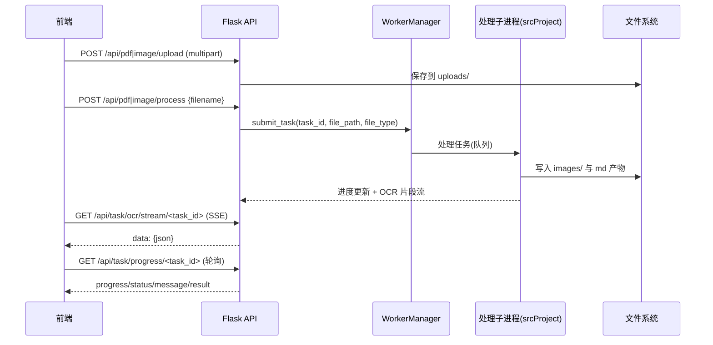
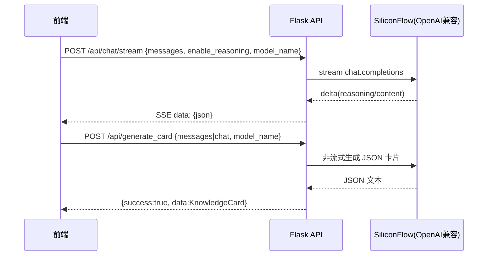

# TextSnap 开发技术文档

本文档面向首次接触 TextSnap 的开发者，目标是做到“只阅读文档即可参与开发与排障”。内容以当前仓库实现为准（包含 `srcProject` 解析流水线 + `flask_react` Web 服务 + `testsnap-react` 前端）。

---

## 1. 项目概述

### 1.1 项目目标

将复杂 PDF/图片类文档（包含标题、正文、表格、图片、公式等结构）自动解析并转换为结构化 Markdown，同时提供可视化与交互式 Web UI（上传、进度、流式预览、聊天与学习卡片生成）。

### 1.2 核心功能

- 文档输入：PDF、常见图片格式（png/jpg/jpeg/gif/bmp/webp）
- 版式检测：基于 DocLayout YOLO 模型定位块级结构（标题/文本/表格/图片等）
- OCR 识别：对需要 OCR 的区域并发识别，并支持流式追加 Markdown
- 阅读顺序：基于阅读顺序模型/算法（当前为 `Xy_Cut`）输出符合阅读习惯的块顺序
- Markdown 生成：按阅读顺序组合文本/表格/图片链接，输出 `.md` + `images/`
- 结果可视化：输出检测框/顺序等可视化结果到 `srcProject/output`
- Web UI：
  - 上传与处理（PDF/图片）
  - 处理进度与流式 Markdown 预览
  - 聊天（SSE 流式）
  - 学习卡片生成（支持 JSON 与 Markdown 两种生成方式）

### 1.3 使用场景

- 论文/报告/说明书从 PDF 转为可编辑 Markdown
- 图片扫描件 OCR + 结构化整理
- 文档解析后，基于片段/表格/图片与大模型对话并生成学习卡片

### 1.4 目标用户

- 需要批量解析复杂文档的研发/运营人员
- 需要将知识内容结构化归档并复习的学习者
- 希望二次开发文档解析能力的工程团队

### 1.5 系统价值

- 降低人工复制/排版成本，提升结构化转换质量
- 解析过程可追踪（进度、流式输出、可视化）
- 支持“解析 → 对话 → 卡片沉淀”的学习闭环

---

## 2. 整体系统架构

### 2.1 架构说明

系统分为三层：

- 前端（React/Vite）：交互、上传、SSE 渲染、卡片/聊天本地存储
- 后端（Flask）：API 网关、文件管理、任务调度、SSE 转发
- 解析与模型层（`srcProject`）：布局检测、OCR、阅读顺序、Markdown/可视化产物生成

系统不依赖数据库；解析产物落盘到项目目录下。前端的会话/卡片等轻量数据使用浏览器 localStorage。

### 2.2 架构图（组件关系）

```mermaid
flowchart LR
  subgraph Browser[前端: testsnap-react]
    UI[页面/组件]
    LS[(localStorage)]
  end

  subgraph Backend[后端: flask_react (Flask)]
    API[REST API]
    SSE[SSE 流式通道]
    FS[FileService]
    MS[MarkdownService]
    CS[ChatService]
    WM[WorkerManager]
  end

  subgraph Core[解析与模型: srcProject]
    Pipeline[main_process_sequence.py]
    MM[ModelManager]
    Layout[DocLayout YOLO]
    OCR[SiliconFlow OCR/API]
    ReadModel[阅读顺序: Xy_Cut]
  end

  subgraph Storage[存储(文件系统)]
    Uploads[srcProject/output/visualizations/uploads]
    Outputs[srcProject/output/visualizations/<doc>/]
  end

  UI -->|HTTP| API
  UI -->|SSE| SSE
  UI <--> LS

  API --> FS
  API --> MS
  API --> CS
  FS -->|提交任务| WM
  WM -->|子进程/daemon| Pipeline

  Pipeline --> MM
  MM --> Layout
  MM --> OCR
  MM --> ReadModel
  Pipeline -->|写入| Outputs
  FS -->|写入| Uploads
  MS -->|读取| Outputs
  API -->|静态文件| Storage
```

### 2.3 关键数据流

#### 2.3.1 文档解析数据流（上传 → 处理 → 产物）



#### 2.3.2 聊天与卡片数据流（聊天 SSE → 卡片生成）



---

## 3. 技术栈说明

### 3.1 语言与运行时

- Python 3.10（后端与解析流水线）
- Node.js（前端开发构建，推荐版本见 [README.md](file:///f:/ysh_loc_office/projects/practice/TextSnap/README.md)）

### 3.2 后端（Web）

- Flask 3.x：HTTP API、SSE、文件服务
- flask-cors：跨域
- python-dotenv：加载 `.env`
- multiprocessing + threading：任务子进程、守护进程/监控与队列通信

### 3.3 解析与模型

- doclayout_yolo：文档版式检测模型封装
- torch / transformers：本地推理与模型加载依赖
- PyMuPDF：PDF 页渲染
- Pillow：图像读写与裁剪
- SiliconFlow(OpenAI 兼容接口)：OCR/API 模型与聊天模型

### 3.4 前端

- React 19 + Vite 7：SPA 与开发服务器
- SSE：聊天与 OCR 流式展示
- localStorage：会话、卡片、队列等本地状态持久化

### 3.5 存储与数据

- 文件系统：上传临时文件、解析产物（Markdown/图片/可视化）
- 无数据库：后端任务状态存于内存结构（重启会丢失进行中任务）

---

## 4. 项目目录结构

以仓库根目录为 `TextSnap/`：

```text
TextSnap/
├─ configs.yaml                      # 模型/设备/外部API配置
├─ requirements.txt                  # Python 依赖
├─ scripts/
│  └─ download_models.py             # 下载预训练模型
├─ srcProject/                       # 解析流水线与模型实现
│  ├─ config/                        # 读取 configs.yaml，输出全局配置常量
│  ├─ data_loaders/                  # PDF/图片数据加载
│  ├─ models/                        # 模型封装与推理逻辑
│  ├─ utlis/                         # 后处理、可视化、通用工具
│  ├─ output/                        # 示例产物（可提交的样例）
│  └─ main_process_sequence.py       # 端到端解析主流程
├─ flask_react/                      # Flask 后端 + React 前端
│  ├─ server.py                      # Flask 启动入口
│  ├─ app.py                         # create_app，注入 services
│  ├─ routes.py                      # API 路由定义（/api/*）
│  ├─ services.py                    # FileService/ChatService/WorkerManager 等
│  ├─ worker_daemon.py               # 独立 worker 守护进程（daemon 模式）
│  └─ testsnap-react/                # React 前端项目（Vite）
└─ tests/                            # 测试数据与测试入口（当前以 test_data 为主）
```

---

## 5. 模块设计

### 5.1 解析流水线（srcProject）

入口：`srcProject/main_process_sequence.py` 的 `main()`。

- 功能
  - 读取输入（PDF/图片）
  - 布局检测 → OCR 并发识别 → 阅读顺序 → 生成 Markdown → 输出可视化
- 输入
  - `path`：相对项目根目录的文件路径（例如 `tests/test_data/demo1_页面_3.png`）
- 输出
  - `md_save_path`：`srcProject/output/visualizations/<doc>/<doc>.md`
  - `visualize_path`：可视化产物目录/文件路径（由 `visualize_document` 决定）

关联代码：
- [main_process_sequence.py](file:///f:/ysh_loc_office/projects/practice/TextSnap/srcProject/main_process_sequence.py)
- [ModelManager](file:///f:/ysh_loc_office/projects/practice/TextSnap/srcProject/models/model_manager.py)

### 5.2 模型管理（ModelManager）

`ModelManager` 统一管理：

- 布局检测模型（`DocLayoutYOLO`）：权重由 `configs.yaml` 的 `layout_weights_config` 指定
- 阅读顺序模型/算法（`Xy_Cut`）：由 `read_weights_config` 指定
- OCR API 模型（`Silicon`）：由 `gpt-api` 指定

运行时可更新（Web UI 用途）：

- 更换阅读顺序模型：`change_read_model(model_name)`
- 更换 OCR API 模型：`change_ocr_recognizer(model_name, api_key, base_url, api_name)`

关联代码：
- [model_manager.py](file:///f:/ysh_loc_office/projects/practice/TextSnap/srcProject/models/model_manager.py)
- [settings.py](file:///f:/ysh_loc_office/projects/practice/TextSnap/srcProject/config/settings.py)

### 5.3 后端服务（flask_react）

#### 5.3.1 create_app 与依赖注入

`flask_react/app.py` 在启动时构建并注入：

- `WorkerManager`：启动/监控处理子进程（支持 embedded/daemon）
- `FileService`：上传文件保存、创建任务、提交任务给 worker
- `MarkdownService`：读取 `.md` 文件返回内容与 `file_dir`
- `ChatService`：对接 SiliconFlow(OpenAI 兼容) 流式聊天与卡片生成

关联代码：
- [create_app](file:///f:/ysh_loc_office/projects/practice/TextSnap/flask_react/app.py#L25-L72)

#### 5.3.2 WorkerManager（解析任务执行）

Worker 有两种运行方式，由环境变量 `TEXTSNAP_WORKER_MODE` 控制：

- `embedded`（默认）：Flask 进程内起两个子进程槽位（active/standby），通过 multiprocessing Queue 通信
- `daemon`：Flask 作为 Client 连接独立的 worker_daemon（通过 multiprocessing.connection），适合将处理与 Web 分离部署

关联代码：
- [services.py](file:///f:/ysh_loc_office/projects/practice/TextSnap/flask_react/services.py)
- [worker_daemon.py](file:///f:/ysh_loc_office/projects/practice/TextSnap/flask_react/worker_daemon.py)

#### 5.3.3 前端（testsnap-react）

关键页面/能力：

- 文件处理页：上传 → 处理 → 进度轮询 → OCR SSE 流 → Markdown 预览与编辑
- 聊天页：会话列表 + 流式聊天 + 附件片段加入聊天 + 学习卡片生成

关联代码：
- [FileProcessing.jsx](file:///f:/ysh_loc_office/projects/practice/TextSnap/flask_react/testsnap-react/src/pages/FileProcessing.jsx)
- [ChatPage.jsx](file:///f:/ysh_loc_office/projects/practice/TextSnap/flask_react/testsnap-react/src/pages/ChatPage.jsx)

---

## 6. API 接口设计（Flask）

默认端口 `PORT=7861`，API 前缀 `/api`。

### 6.1 健康检查

- GET `/api/health`

Response（示例）：

```json
{
  "status": "healthy",
  "project_root": "F:\\\\ysh_loc_office\\\\projects\\\\practice\\\\TextSnap",
  "active_tasks": 0
}
```

### 6.2 Markdown 读取

- POST `/api/markdown`

Request JSON：

```json
{ "path": "srcProject/output/visualizations/demo1/demo1.md" }
```

Response JSON：

```json
{
  "success": true,
  "content": "# ...markdown...",
  "file_dir": "srcProject/output/visualizations/demo1",
  "file_path": "srcProject/output/visualizations/demo1/demo1.md",
  "api_base_url": "http://localhost:7861/api/files"
}
```

### 6.3 文件服务（静态文件下载/预览）

- GET `/api/files/<path:filename>`

说明：

- `filename` 必须是项目根目录下的相对路径，后端会校验防止目录穿越。

### 6.4 上传

- POST `/api/pdf/upload`
- POST `/api/image/upload`

Request：

- `multipart/form-data`，字段名 `file`

Response（示例）：

```json
{
  "success": true,
  "message": "pdf文件上传成功",
  "file_info": {
    "original_filename": "demo.pdf",
    "unique_filename": "a1b2c3d4.pdf",
    "file_size": 123456,
    "file_path": "F:\\\\...\\\\uploads\\\\pdfs\\\\a1b2c3d4.pdf"
  }
}
```

### 6.5 发起处理（异步任务）

- POST `/api/pdf/process`
- POST `/api/image/process`

Request JSON：

```json
{ "filename": "a1b2c3d4.pdf" }
```

Response JSON：

```json
{ "success": true, "message": "pdf文件处理已启动", "task_id": "pdf_1700000000000_abcd" }
```

### 6.6 任务查询

- GET `/api/task/progress/<task_id>`
- GET `/api/task/list`

Response（progress 示例）：

```json
{
  "success": true,
  "task_id": "pdf_1700000000000_abcd",
  "progress": 42.5,
  "status": "processing",
  "message": "OCR处理中...12/30",
  "result": null,
  "updated_at": 1700000000.123
}
```

### 6.7 模型配置更新（运行时）

- POST `/api/update/model_config`

Request JSON（示例：更新 OCR API 模型）：

```json
{
  "ocr_api_model": {
    "api_name": "Siliconflow",
    "base_url": "https://api.siliconflow.cn/v1",
    "api_key": ["sk-***"],
    "model_name": "Qwen/Qwen2.5-VL-72B-Instruct"
  }
}
```

### 6.8 聊天

- POST `/api/chat`
- POST `/api/chat/stream`（SSE）
- POST `/api/chat/cancel`

Request JSON（最小示例）：

```json
{
  "messages": [
    { "role": "system", "content": "你是一个有帮助的助手。" },
    { "role": "user", "content": "解释一下阅读顺序算法 Xy_Cut。" }
  ],
  "enable_reasoning": false,
  "model_name": "Qwen/Qwen3-VL-235B-A22B-Instruct",
  "conv_id": "optional",
  "request_id": "optional"
}
```

### 6.9 学习卡片生成

- POST `/api/generate_card`（返回结构化 JSON）
- POST `/api/generate_card/stream`（SSE，返回 Markdown delta）
- 兼容路由：POST `/generate_card` 与 POST `/generate_card/stream`

---

## 7. 数据结构设计

### 7.1 ChatMessage（前后端通用）

| 字段 | 类型 | 必填 | 说明 |
|---|---|---:|---|
| role | string | 是 | system/user/assistant |
| content | string 或 array | 是 | 文本或多模态 parts |
| image_url | string | 否 | 单图 URL |
| images | string[] | 否 | 多图 URL 列表 |
| image_base64 | string | 否 | base64（可不含 data: 前缀） |

### 7.2 KnowledgeCard（学习卡片）

| 字段 | 类型 | 说明 |
|---|---|---|
| title | string | 卡片标题 |
| knowledge_points | string[] | 3-5 条为宜 |
| example.question | string | 例题题目 |
| example.analysis | string | 例题解析 |
| summary | string | 一句话总结 |

### 7.3 TaskProgress（任务进度）

| 字段 | 类型 | 说明 |
|---|---|---|
| task_id | string | 任务 ID |
| progress | number | 0-100（可为小数） |
| status | string | started/queued/processing/done/error/unknown |
| message | string | 人类可读进度提示 |
| result | any | 成功时可包含产物路径等（视实现而定） |

---

## 8. 流式通信设计（SSE）

项目使用 Server-Sent Events（`Content-Type: text/event-stream`），服务端以 `\\n\\n` 分隔消息。

### 8.1 OCR 流（任务流式 Markdown 追加）

接口：

- GET `/api/task/ocr/stream/<task_id>`

消息：

```text
data: {"type":"append","content":"## 标题\\n\\n"}

```

完成：

```text
event: done
data: [DONE]

```

### 8.2 聊天流

接口：

- POST `/api/chat/stream`

典型 payload：

```json
{ "type": "content", "content": "..." }
```

或

```json
{ "type": "reasoning", "content": "..." }
```

---

## 9. 关键算法与 AI 模块说明

### 9.1 布局检测（DocLayout YOLO）

- 输入：PDF 渲染页/图片（RGB）
- 输出：每页若干块（包含 category_id、poly 等）
- 后处理：IOU 过滤、poly→bbox，用于裁剪 OCR 输入

### 9.2 OCR 并发与流式写入

- `ocr_test()` 使用 `asyncio.Semaphore` 控制并发数量（默认 30）
- 每个块 OCR 完成后将内容格式化为 Markdown，并通过 SSE 追加

### 9.3 阅读顺序（Xy_Cut）

- 用于将页面块排序，使输出更符合人类阅读顺序

---

## 10. 开发规范

### 10.1 代码风格

- Python：建议使用 ruff（仓库依赖已包含）
- 前端：ESLint 配置位于 `testsnap-react/eslint.config.js`，建议在前端目录运行 `npx eslint .`

### 10.2 密钥与配置（必须）

- `configs.yaml` 中包含外部 API Key，开发/部署时必须通过环境注入或本地私有配置管理，严禁提交真实密钥到公共仓库。

---

## 11. 部署方式

### 11.1 本地启动

后端：

```bash
cd flask_react
python server.py
```

前端：

```bash
cd flask_react/testsnap-react
npm install
npm run dev
```

### 11.2 环境变量（.env）

| 变量 | 默认值 | 说明 |
|---|---|---|
| PORT | 7861 | Flask 监听端口 |
| HOST | 0.0.0.0 | Flask 监听地址 |
| BASE_URL | 空 | 外部访问基址 |
| DEBUG | false | Flask debug |
| TEXTSNAP_WORKER_MODE | embedded | embedded/daemon |
| WORKER_PORT | 7862 | daemon 模式 worker 端口 |
| WORKER_AUTHKEY | textsnap | daemon 模式鉴权 key |

### 11.3 daemon 模式部署（处理与 Web 分离）

启动 worker daemon：

```bash
cd flask_react
set TEXTSNAP_WORKER_MODE=daemon
python worker_daemon.py
```

再启动 Flask：

```bash
cd flask_react
set TEXTSNAP_WORKER_MODE=daemon
python server.py
```

---

## 12. 扩展设计

- 模型扩展入口：`ModelFactory.create()` 与 `configs.yaml` + `settings.py`
- 任务持久化：当前任务状态在内存中，后续可引入 SQLite/Redis
- 前端能力：文档库管理、卡片导出/同步

---

## 13. 开发流程建议

### 13.1 本地开发推荐步骤

- 安装依赖：`pip install -r requirements.txt`
- 下载模型：`python scripts/download_models.py`
- 配置 `configs.yaml`（设备、模型权重路径、API Key/Model Name）
- 启动后端与前端
- 用 `tests/test_data` 样例进行端到端验证

### 13.2 调试与排障

- 解析结果落盘：
  - `srcProject/output/visualizations/<doc>/<doc>.md`
  - `srcProject/output/visualizations/<doc>/images/`
- 图片无法展示时，优先通过 `/api/files/<relative_path>` 访问并确认路径正确
